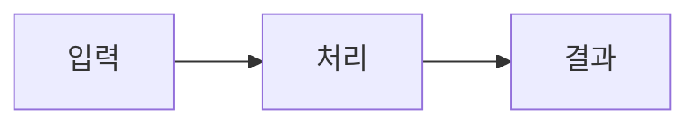

## 🧾 PR 요약

| 항목 | 내용 |
| --- | --- |
| 변경 유형 | `feat` / `fix` / `docs` / `chore` / `refactor` / `test` |
| 핵심 변경 |  |
| 영향 범위 |  |

## 🎯 변경 목적

- 해결 대상:
- 기대 결과:

## 🛠️ 주요 변경 사항

- [ ]
- [ ]

## 👀 리뷰 가이드

| 항목 | 내용 |
| --- | --- |
| 핵심 리뷰 포인트 |  |
| 주요 변경 파일·모듈 |  |
| 리뷰 제외 대상 | 없음 |

## 🧪 검증 결과

| 검증 항목 | 실행 명령·방법 | 결과 |
| --- | --- | --- |
| 린트·정적 분석 |  | ✅ / ❌ / 미실행 |
| 테스트 |  | ✅ / ❌ / 미실행 |
| 수동 검증 |  | ✅ / ❌ / 미실행 |

## 🖼️ 시각 자료

<!-- 해당하지 않으면 이 섹션을 삭제합니다. -->

<!-- UI 변경은 아래 표를 사용합니다.
| 변경 전 | 변경 후 |
| --- | --- |
| 이미지 | 이미지 |
-->

<!-- 복잡한 처리 흐름이나 컴포넌트 관계는 Mermaid를 사용합니다.

-->

## ⚠️ 영향과 대응

| 항목 | 내용 |
| --- | --- |
| 예상 영향 |  |
| 주요 리스크 |  |
| 대응·롤백 방법 |  |

## 🔗 관련 이슈

- Closes #
- Refs #

## ✅ 체크리스트

- [ ] 관련 테스트와 린트를 통과했다
- [ ] 관련 이슈의 완료 조건을 충족했다
- [ ] 필요한 문서를 함께 수정했다
- [ ] 시크릿, 개인정보, 불필요한 생성 산출물을 포함하지 않았다
- [ ] 미실행한 검증과 남은 리스크를 명시했다
