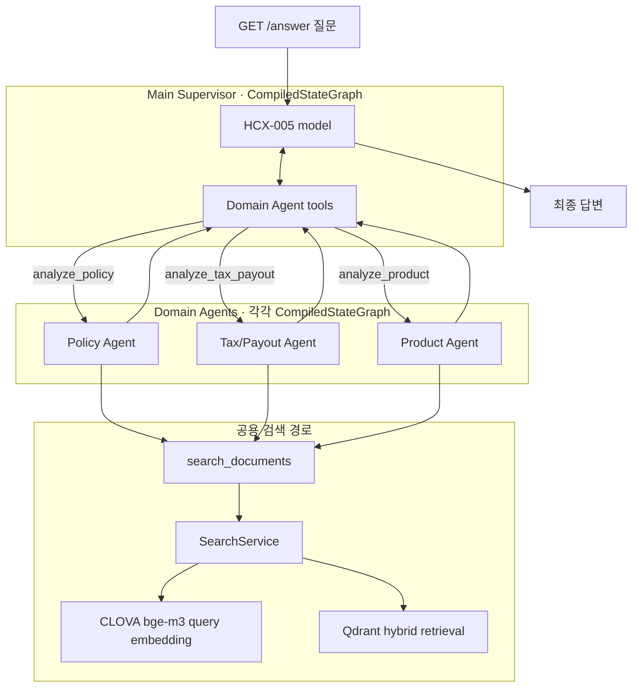

# Agent 전체 그래프

<!-- 이 파일은 tools/render_agent_graphs.py로 생성됩니다. 직접 수정하지 마세요. -->

`make agent-graph`로 현재 코드에서 다시 생성합니다. 그래프 생성에는 HCX, Qdrant 또는 외부 네트워크 연결이 필요하지 않습니다.

## 전체 호출 구조

Supervisor가 Domain Agent를 LangChain Tool로 호출하므로, 이 그림은 독립적으로 컴파일된 그래프 사이의 런타임 호출 경계를 함께 표시합니다.



## Main Supervisor 컴파일 그래프

```mermaid
---
config:
  flowchart:
    curve: linear
---
graph TD;
	__start__([<p>__start__</p>]):::first
	model(model)
	tools(tools)
	SupervisorModelCallLimit\2ebefore_model(SupervisorModelCallLimit.before_model)
	SupervisorModelCallLimit\2eafter_model(SupervisorModelCallLimit.after_model)
	ToolCallLimitMiddleware\5banalyze_policy\5d\2eafter_model(ToolCallLimitMiddleware[analyze_policy].after_model)
	ToolCallLimitMiddleware\5banalyze_tax_payout\5d\2eafter_model(ToolCallLimitMiddleware[analyze_tax_payout].after_model)
	ToolCallLimitMiddleware\5banalyze_product\5d\2eafter_model(ToolCallLimitMiddleware[analyze_product].after_model)
	__end__([<p>__end__</p>]):::last
	SupervisorModelCallLimit\2eafter_model -.-> SupervisorModelCallLimit\2ebefore_model;
	SupervisorModelCallLimit\2eafter_model -.-> __end__;
	SupervisorModelCallLimit\2eafter_model -.-> tools;
	SupervisorModelCallLimit\2ebefore_model -.-> __end__;
	SupervisorModelCallLimit\2ebefore_model -.-> model;
	ToolCallLimitMiddleware\5banalyze_policy\5d\2eafter_model -.-> SupervisorModelCallLimit\2eafter_model;
	ToolCallLimitMiddleware\5banalyze_policy\5d\2eafter_model -.-> __end__;
	ToolCallLimitMiddleware\5banalyze_product\5d\2eafter_model -.-> ToolCallLimitMiddleware\5banalyze_tax_payout\5d\2eafter_model;
	ToolCallLimitMiddleware\5banalyze_product\5d\2eafter_model -.-> __end__;
	ToolCallLimitMiddleware\5banalyze_tax_payout\5d\2eafter_model -.-> ToolCallLimitMiddleware\5banalyze_policy\5d\2eafter_model;
	ToolCallLimitMiddleware\5banalyze_tax_payout\5d\2eafter_model -.-> __end__;
	__start__ --> SupervisorModelCallLimit\2ebefore_model;
	model --> ToolCallLimitMiddleware\5banalyze_product\5d\2eafter_model;
	tools -.-> SupervisorModelCallLimit\2ebefore_model;
	classDef default fill:#f2f0ff,line-height:1.2
	classDef first fill-opacity:0
	classDef last fill:#bfb6fc
```

## Policy Domain Agent 컴파일 그래프

```mermaid
---
config:
  flowchart:
    curve: linear
---
graph TD;
	__start__([<p>__start__</p>]):::first
	model(model)
	tools(tools)
	CompleteDomainResult\2ebefore_model(CompleteDomainResult.before_model)
	RequireDomainTool\2eafter_model(RequireDomainTool.after_model)
	SingleDomainSubmitPerModelCall\2eafter_model(SingleDomainSubmitPerModelCall.after_model)
	DomainModelCallLimit\2ebefore_model(DomainModelCallLimit.before_model)
	DomainModelCallLimit\2eafter_model(DomainModelCallLimit.after_model)
	ToolCallLimitMiddleware\5bsearch_documents\5d\2eafter_model(ToolCallLimitMiddleware[search_documents].after_model)
	ToolCallLimitMiddleware\5bsubmit_domain_result\5d\2eafter_model(ToolCallLimitMiddleware[submit_domain_result].after_model)
	__end__([<p>__end__</p>]):::last
	CompleteDomainResult\2ebefore_model -.-> DomainModelCallLimit\2ebefore_model;
	CompleteDomainResult\2ebefore_model -.-> __end__;
	DomainModelCallLimit\2eafter_model --> SingleDomainSubmitPerModelCall\2eafter_model;
	DomainModelCallLimit\2ebefore_model -.-> __end__;
	DomainModelCallLimit\2ebefore_model -.-> model;
	RequireDomainTool\2eafter_model -.-> CompleteDomainResult\2ebefore_model;
	RequireDomainTool\2eafter_model -.-> __end__;
	RequireDomainTool\2eafter_model -.-> tools;
	SingleDomainSubmitPerModelCall\2eafter_model --> RequireDomainTool\2eafter_model;
	ToolCallLimitMiddleware\5bsearch_documents\5d\2eafter_model -.-> DomainModelCallLimit\2eafter_model;
	ToolCallLimitMiddleware\5bsearch_documents\5d\2eafter_model -.-> __end__;
	ToolCallLimitMiddleware\5bsubmit_domain_result\5d\2eafter_model -.-> ToolCallLimitMiddleware\5bsearch_documents\5d\2eafter_model;
	ToolCallLimitMiddleware\5bsubmit_domain_result\5d\2eafter_model -.-> __end__;
	__start__ --> CompleteDomainResult\2ebefore_model;
	model --> ToolCallLimitMiddleware\5bsubmit_domain_result\5d\2eafter_model;
	tools -.-> CompleteDomainResult\2ebefore_model;
	classDef default fill:#f2f0ff,line-height:1.2
	classDef first fill-opacity:0
	classDef last fill:#bfb6fc
```

## Tax/Payout Domain Agent 컴파일 그래프

```mermaid
---
config:
  flowchart:
    curve: linear
---
graph TD;
	__start__([<p>__start__</p>]):::first
	model(model)
	tools(tools)
	CompleteDomainResult\2ebefore_model(CompleteDomainResult.before_model)
	RequireDomainTool\2eafter_model(RequireDomainTool.after_model)
	SingleDomainSubmitPerModelCall\2eafter_model(SingleDomainSubmitPerModelCall.after_model)
	DomainModelCallLimit\2ebefore_model(DomainModelCallLimit.before_model)
	DomainModelCallLimit\2eafter_model(DomainModelCallLimit.after_model)
	ToolCallLimitMiddleware\5bsearch_documents\5d\2eafter_model(ToolCallLimitMiddleware[search_documents].after_model)
	ToolCallLimitMiddleware\5bsubmit_domain_result\5d\2eafter_model(ToolCallLimitMiddleware[submit_domain_result].after_model)
	__end__([<p>__end__</p>]):::last
	CompleteDomainResult\2ebefore_model -.-> DomainModelCallLimit\2ebefore_model;
	CompleteDomainResult\2ebefore_model -.-> __end__;
	DomainModelCallLimit\2eafter_model --> SingleDomainSubmitPerModelCall\2eafter_model;
	DomainModelCallLimit\2ebefore_model -.-> __end__;
	DomainModelCallLimit\2ebefore_model -.-> model;
	RequireDomainTool\2eafter_model -.-> CompleteDomainResult\2ebefore_model;
	RequireDomainTool\2eafter_model -.-> __end__;
	RequireDomainTool\2eafter_model -.-> tools;
	SingleDomainSubmitPerModelCall\2eafter_model --> RequireDomainTool\2eafter_model;
	ToolCallLimitMiddleware\5bsearch_documents\5d\2eafter_model -.-> DomainModelCallLimit\2eafter_model;
	ToolCallLimitMiddleware\5bsearch_documents\5d\2eafter_model -.-> __end__;
	ToolCallLimitMiddleware\5bsubmit_domain_result\5d\2eafter_model -.-> ToolCallLimitMiddleware\5bsearch_documents\5d\2eafter_model;
	ToolCallLimitMiddleware\5bsubmit_domain_result\5d\2eafter_model -.-> __end__;
	__start__ --> CompleteDomainResult\2ebefore_model;
	model --> ToolCallLimitMiddleware\5bsubmit_domain_result\5d\2eafter_model;
	tools -.-> CompleteDomainResult\2ebefore_model;
	classDef default fill:#f2f0ff,line-height:1.2
	classDef first fill-opacity:0
	classDef last fill:#bfb6fc
```

## Product Domain Agent 컴파일 그래프

```mermaid
---
config:
  flowchart:
    curve: linear
---
graph TD;
	__start__([<p>__start__</p>]):::first
	model(model)
	tools(tools)
	CompleteDomainResult\2ebefore_model(CompleteDomainResult.before_model)
	RequireDomainTool\2eafter_model(RequireDomainTool.after_model)
	SingleDomainSubmitPerModelCall\2eafter_model(SingleDomainSubmitPerModelCall.after_model)
	DomainModelCallLimit\2ebefore_model(DomainModelCallLimit.before_model)
	DomainModelCallLimit\2eafter_model(DomainModelCallLimit.after_model)
	ToolCallLimitMiddleware\5bsearch_documents\5d\2eafter_model(ToolCallLimitMiddleware[search_documents].after_model)
	ToolCallLimitMiddleware\5bsubmit_domain_result\5d\2eafter_model(ToolCallLimitMiddleware[submit_domain_result].after_model)
	__end__([<p>__end__</p>]):::last
	CompleteDomainResult\2ebefore_model -.-> DomainModelCallLimit\2ebefore_model;
	CompleteDomainResult\2ebefore_model -.-> __end__;
	DomainModelCallLimit\2eafter_model --> SingleDomainSubmitPerModelCall\2eafter_model;
	DomainModelCallLimit\2ebefore_model -.-> __end__;
	DomainModelCallLimit\2ebefore_model -.-> model;
	RequireDomainTool\2eafter_model -.-> CompleteDomainResult\2ebefore_model;
	RequireDomainTool\2eafter_model -.-> __end__;
	RequireDomainTool\2eafter_model -.-> tools;
	SingleDomainSubmitPerModelCall\2eafter_model --> RequireDomainTool\2eafter_model;
	ToolCallLimitMiddleware\5bsearch_documents\5d\2eafter_model -.-> DomainModelCallLimit\2eafter_model;
	ToolCallLimitMiddleware\5bsearch_documents\5d\2eafter_model -.-> __end__;
	ToolCallLimitMiddleware\5bsubmit_domain_result\5d\2eafter_model -.-> ToolCallLimitMiddleware\5bsearch_documents\5d\2eafter_model;
	ToolCallLimitMiddleware\5bsubmit_domain_result\5d\2eafter_model -.-> __end__;
	__start__ --> CompleteDomainResult\2ebefore_model;
	model --> ToolCallLimitMiddleware\5bsubmit_domain_result\5d\2eafter_model;
	tools -.-> CompleteDomainResult\2ebefore_model;
	classDef default fill:#f2f0ff,line-height:1.2
	classDef first fill-opacity:0
	classDef last fill:#bfb6fc
```
