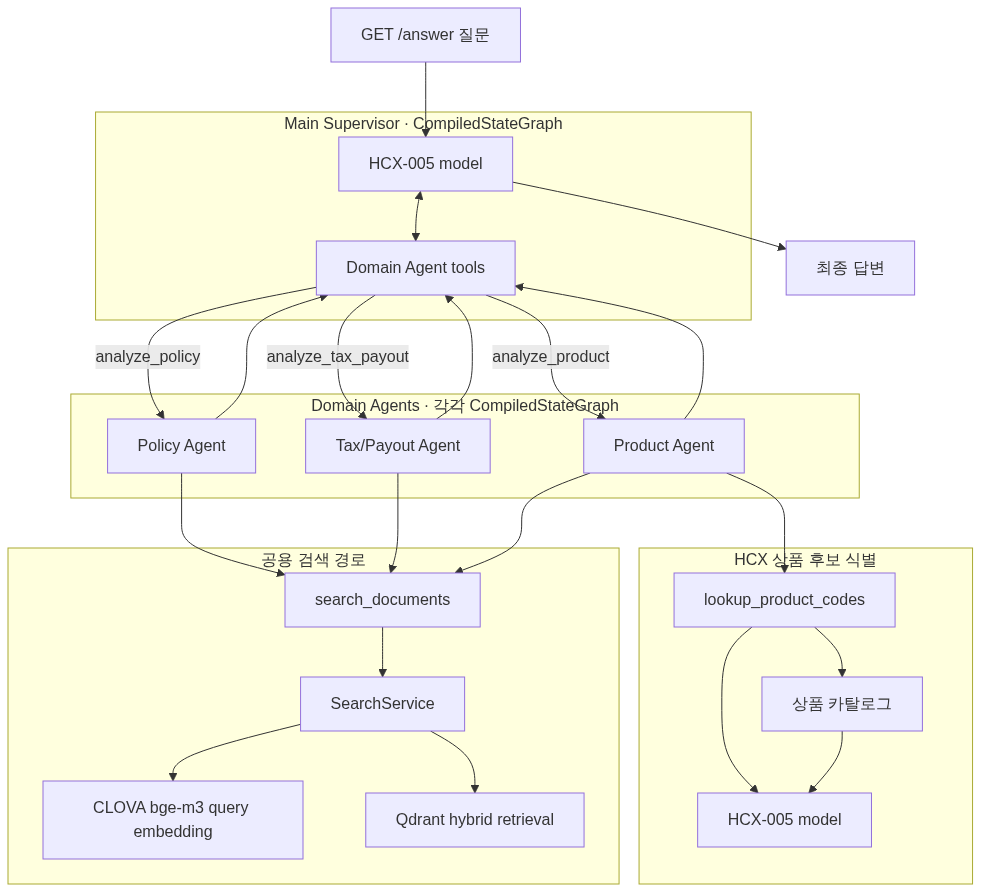
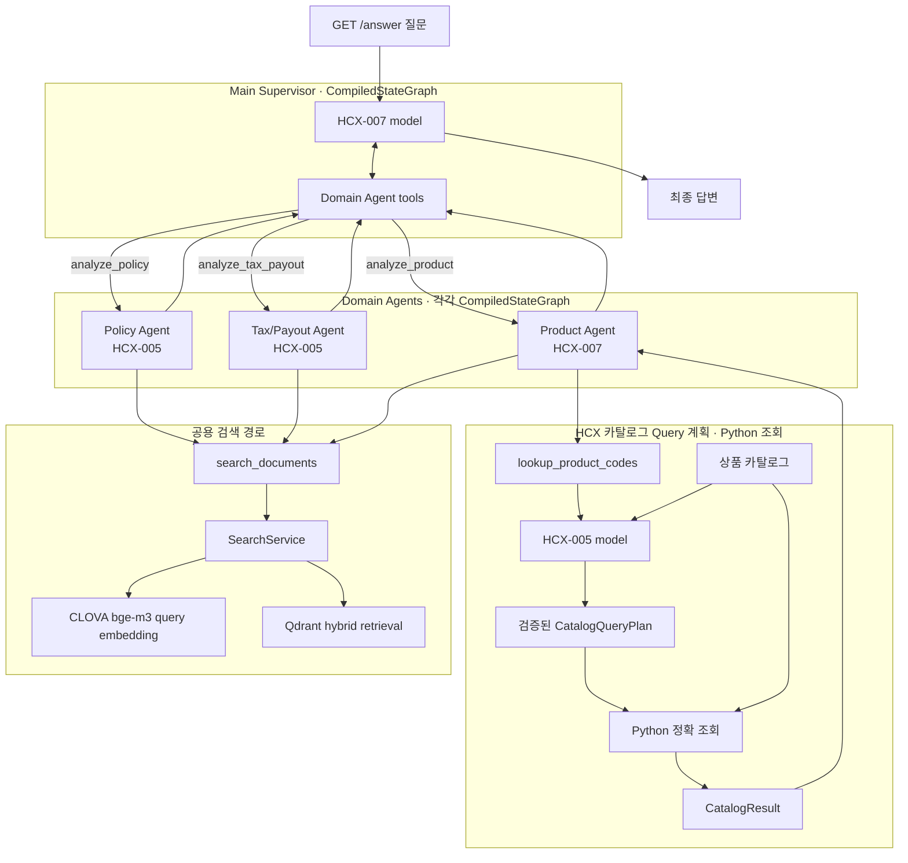
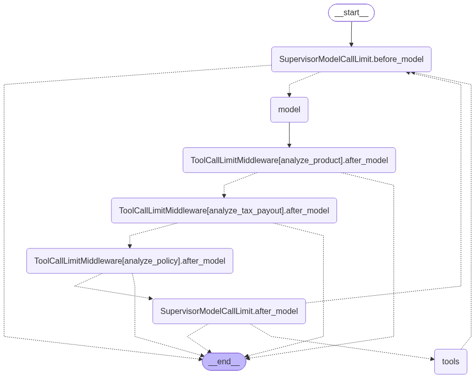
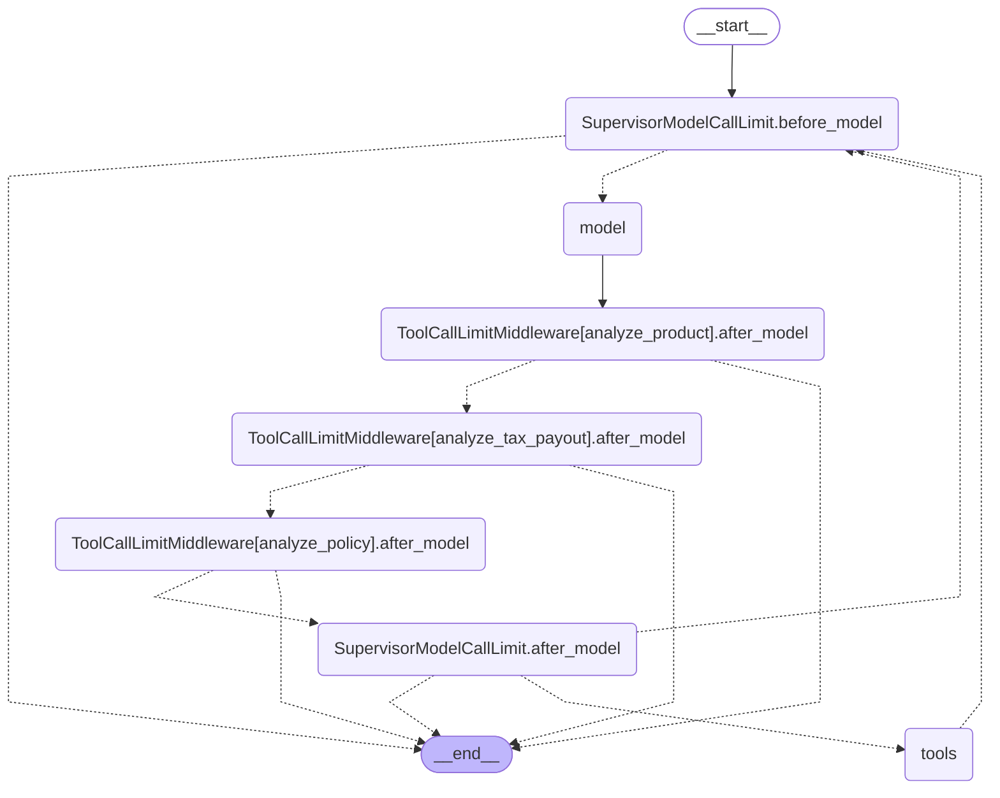
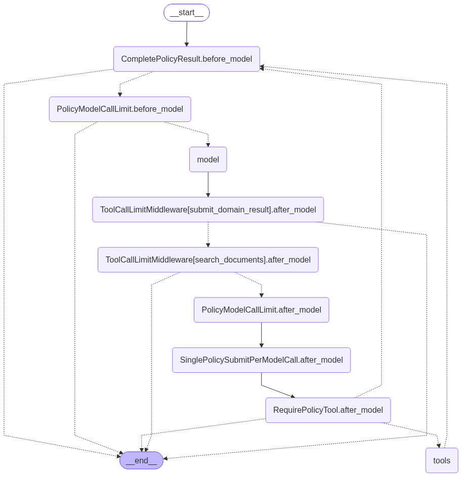
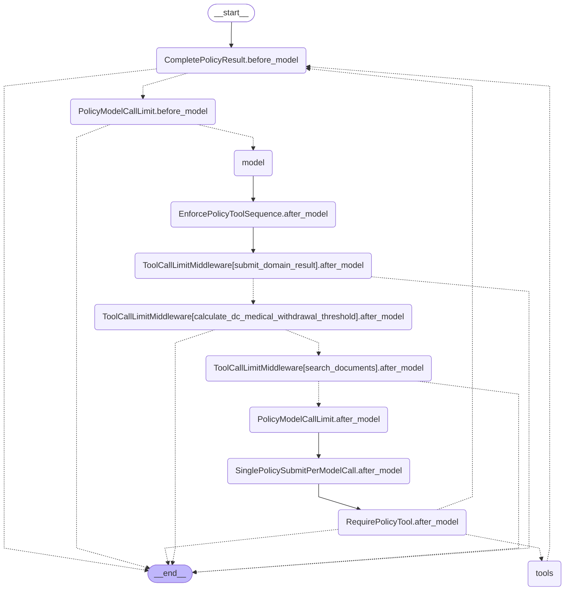
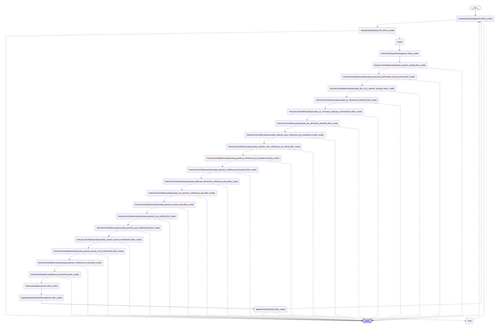
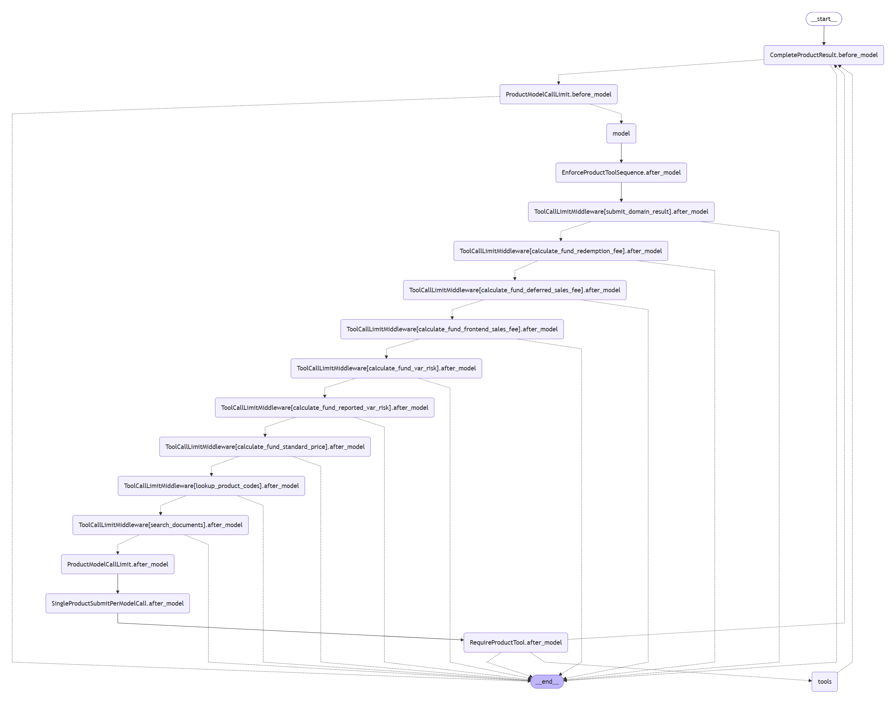
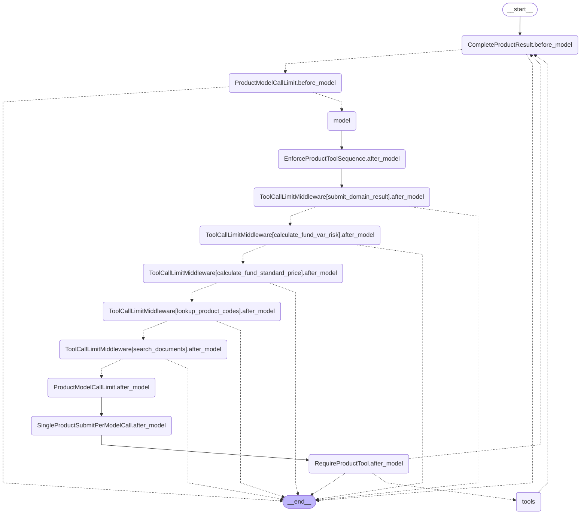

# Agent 전체 그래프

<!-- 이 파일은 tools/render_agent_graphs.py로 생성됩니다. 직접 수정하지 마세요. -->

`make agent-graph`로 현재 코드에서 PNG와 함께 다시 생성합니다. 컴파일 그래프는 LangGraph의 `get_graph(xray=True)` 결과를 사용합니다.

## 전체 호출 구조

Mermaid 원본 보기

## Main Supervisor 컴파일 그래프

Mermaid 원본 보기

## Policy Domain Agent 컴파일 그래프

Mermaid 원본 보기

## Tax/Payout Domain Agent 컴파일 그래프

```mermaid
---
config:
  flowchart:
    curve: linear
---
graph TD;
	__start__([<p>__start__</p>]):::first
	model("model")
	tools("tools")
	CompleteTaxPayoutResult\2ebefore_model("CompleteTaxPayoutResult.before_model")
	RequireTaxPayoutTool\2eafter_model("RequireTaxPayoutTool.after_model")
	SingleTaxPayoutSubmitPerModelCall\2eafter_model("SingleTaxPayoutSubmitPerModelCall.after_model")
	TaxPayoutModelCallLimit\2ebefore_model("TaxPayoutModelCallLimit.before_model")
	TaxPayoutModelCallLimit\2eafter_model("TaxPayoutModelCallLimit.after_model")
	ToolCallLimitMiddleware\5bsearch_documents\5d\2eafter_model("ToolCallLimitMiddleware[search_documents].after_model")
	ToolCallLimitMiddleware\5bcalculate_pension_withdrawal_limit\5d\2eafter_model("ToolCallLimitMiddleware[calculate_pension_withdrawal_limit].after_model")
	ToolCallLimitMiddleware\5bcalculate_pension_annual_limit_installment\5d\2eafter_model("ToolCallLimitMiddleware[calculate_pension_annual_limit_installment].after_model")
	ToolCallLimitMiddleware\5bcalculate_pension_period_installment\5d\2eafter_model("ToolCallLimitMiddleware[calculate_pension_period_installment].after_model")
	ToolCallLimitMiddleware\5bcalculate_pension_unit_installment\5d\2eafter_model("ToolCallLimitMiddleware[calculate_pension_unit_installment].after_model")
	ToolCallLimitMiddleware\5bcalculate_pension_tax_credit\5d\2eafter_model("ToolCallLimitMiddleware[calculate_pension_tax_credit].after_model")
	ToolCallLimitMiddleware\5bcalculate_pension_income_tax\5d\2eafter_model("ToolCallLimitMiddleware[calculate_pension_income_tax].after_model")
	ToolCallLimitMiddleware\5bcalculate_non_pension_withdrawal_tax\5d\2eafter_model("ToolCallLimitMiddleware[calculate_non_pension_withdrawal_tax].after_model")
	ToolCallLimitMiddleware\5bcalculate_deferred_retirement_withdrawal_tax\5d\2eafter_model("ToolCallLimitMiddleware[calculate_deferred_retirement_withdrawal_tax].after_model")
	ToolCallLimitMiddleware\5bcalculate_pension_withdrawal_allocation\5d\2eafter_model("ToolCallLimitMiddleware[calculate_pension_withdrawal_allocation].after_model")
	ToolCallLimitMiddleware\5bcalculate_pension_withdrawal_tax_breakdown\5d\2eafter_model("ToolCallLimitMiddleware[calculate_pension_withdrawal_tax_breakdown].after_model")
	ToolCallLimitMiddleware\5bcalculate_medical_care_withdrawal_tax_limit\5d\2eafter_model("ToolCallLimitMiddleware[calculate_medical_care_withdrawal_tax_limit].after_model")
	ToolCallLimitMiddleware\5bcalculate_medical_care_withdrawal_tax_breakdown\5d\2eafter_model("ToolCallLimitMiddleware[calculate_medical_care_withdrawal_tax_breakdown].after_model")
	ToolCallLimitMiddleware\5bcalculate_db_retirement_benefit\5d\2eafter_model("ToolCallLimitMiddleware[calculate_db_retirement_benefit].after_model")
	ToolCallLimitMiddleware\5bcalculate_dc_minimum_employer_contribution\5d\2eafter_model("ToolCallLimitMiddleware[calculate_dc_minimum_employer_contribution].after_model")
	ToolCallLimitMiddleware\5bcalculate_dc_retirement_benefit\5d\2eafter_model("ToolCallLimitMiddleware[calculate_dc_retirement_benefit].after_model")
	ToolCallLimitMiddleware\5bcalculate_db_to_dc_transfer_amount\5d\2eafter_model("ToolCallLimitMiddleware[calculate_db_to_dc_transfer_amount].after_model")
	ToolCallLimitMiddleware\5bcalculate_executive_retirement_income_limit\5d\2eafter_model("ToolCallLimitMiddleware[calculate_executive_retirement_income_limit].after_model")
	ToolCallLimitMiddleware\5bsubmit_domain_result\5d\2eafter_model("ToolCallLimitMiddleware[submit_domain_result].after_model")
	EnforceTaxPayoutToolSequence\2eafter_model("EnforceTaxPayoutToolSequence.after_model")
	__end__([<p>__end__</p>]):::last
	CompleteTaxPayoutResult\2ebefore_model -.-> TaxPayoutModelCallLimit\2ebefore_model;
	CompleteTaxPayoutResult\2ebefore_model -.-> __end__;
	EnforceTaxPayoutToolSequence\2eafter_model --> ToolCallLimitMiddleware\5bsubmit_domain_result\5d\2eafter_model;
	RequireTaxPayoutTool\2eafter_model -.-> CompleteTaxPayoutResult\2ebefore_model;
	RequireTaxPayoutTool\2eafter_model -.-> __end__;
	RequireTaxPayoutTool\2eafter_model -.-> tools;
	SingleTaxPayoutSubmitPerModelCall\2eafter_model --> RequireTaxPayoutTool\2eafter_model;
	TaxPayoutModelCallLimit\2eafter_model --> SingleTaxPayoutSubmitPerModelCall\2eafter_model;
	TaxPayoutModelCallLimit\2ebefore_model -.-> __end__;
	TaxPayoutModelCallLimit\2ebefore_model -.-> model;
	ToolCallLimitMiddleware\5bcalculate_db_retirement_benefit\5d\2eafter_model -.-> ToolCallLimitMiddleware\5bcalculate_medical_care_withdrawal_tax_breakdown\5d\2eafter_model;
	ToolCallLimitMiddleware\5bcalculate_db_retirement_benefit\5d\2eafter_model -.-> __end__;
	ToolCallLimitMiddleware\5bcalculate_db_to_dc_transfer_amount\5d\2eafter_model -.-> ToolCallLimitMiddleware\5bcalculate_dc_retirement_benefit\5d\2eafter_model;
	ToolCallLimitMiddleware\5bcalculate_db_to_dc_transfer_amount\5d\2eafter_model -.-> __end__;
	ToolCallLimitMiddleware\5bcalculate_dc_minimum_employer_contribution\5d\2eafter_model -.-> ToolCallLimitMiddleware\5bcalculate_db_retirement_benefit\5d\2eafter_model;
	ToolCallLimitMiddleware\5bcalculate_dc_minimum_employer_contribution\5d\2eafter_model -.-> __end__;
	ToolCallLimitMiddleware\5bcalculate_dc_retirement_benefit\5d\2eafter_model -.-> ToolCallLimitMiddleware\5bcalculate_dc_minimum_employer_contribution\5d\2eafter_model;
	ToolCallLimitMiddleware\5bcalculate_dc_retirement_benefit\5d\2eafter_model -.-> __end__;
	ToolCallLimitMiddleware\5bcalculate_deferred_retirement_withdrawal_tax\5d\2eafter_model -.-> ToolCallLimitMiddleware\5bcalculate_non_pension_withdrawal_tax\5d\2eafter_model;
	ToolCallLimitMiddleware\5bcalculate_deferred_retirement_withdrawal_tax\5d\2eafter_model -.-> __end__;
	ToolCallLimitMiddleware\5bcalculate_executive_retirement_income_limit\5d\2eafter_model -.-> ToolCallLimitMiddleware\5bcalculate_db_to_dc_transfer_amount\5d\2eafter_model;
	ToolCallLimitMiddleware\5bcalculate_executive_retirement_income_limit\5d\2eafter_model -.-> __end__;
	ToolCallLimitMiddleware\5bcalculate_medical_care_withdrawal_tax_breakdown\5d\2eafter_model -.-> ToolCallLimitMiddleware\5bcalculate_medical_care_withdrawal_tax_limit\5d\2eafter_model;
	ToolCallLimitMiddleware\5bcalculate_medical_care_withdrawal_tax_breakdown\5d\2eafter_model -.-> __end__;
	ToolCallLimitMiddleware\5bcalculate_medical_care_withdrawal_tax_limit\5d\2eafter_model -.-> ToolCallLimitMiddleware\5bcalculate_pension_withdrawal_tax_breakdown\5d\2eafter_model;
	ToolCallLimitMiddleware\5bcalculate_medical_care_withdrawal_tax_limit\5d\2eafter_model -.-> __end__;
	ToolCallLimitMiddleware\5bcalculate_non_pension_withdrawal_tax\5d\2eafter_model -.-> ToolCallLimitMiddleware\5bcalculate_pension_income_tax\5d\2eafter_model;
	ToolCallLimitMiddleware\5bcalculate_non_pension_withdrawal_tax\5d\2eafter_model -.-> __end__;
	ToolCallLimitMiddleware\5bcalculate_pension_annual_limit_installment\5d\2eafter_model -.-> ToolCallLimitMiddleware\5bcalculate_pension_withdrawal_limit\5d\2eafter_model;
	ToolCallLimitMiddleware\5bcalculate_pension_annual_limit_installment\5d\2eafter_model -.-> __end__;
	ToolCallLimitMiddleware\5bcalculate_pension_income_tax\5d\2eafter_model -.-> ToolCallLimitMiddleware\5bcalculate_pension_tax_credit\5d\2eafter_model;
	ToolCallLimitMiddleware\5bcalculate_pension_income_tax\5d\2eafter_model -.-> __end__;
	ToolCallLimitMiddleware\5bcalculate_pension_period_installment\5d\2eafter_model -.-> ToolCallLimitMiddleware\5bcalculate_pension_annual_limit_installment\5d\2eafter_model;
	ToolCallLimitMiddleware\5bcalculate_pension_period_installment\5d\2eafter_model -.-> __end__;
	ToolCallLimitMiddleware\5bcalculate_pension_tax_credit\5d\2eafter_model -.-> ToolCallLimitMiddleware\5bcalculate_pension_unit_installment\5d\2eafter_model;
	ToolCallLimitMiddleware\5bcalculate_pension_tax_credit\5d\2eafter_model -.-> __end__;
	ToolCallLimitMiddleware\5bcalculate_pension_unit_installment\5d\2eafter_model -.-> ToolCallLimitMiddleware\5bcalculate_pension_period_installment\5d\2eafter_model;
	ToolCallLimitMiddleware\5bcalculate_pension_unit_installment\5d\2eafter_model -.-> __end__;
	ToolCallLimitMiddleware\5bcalculate_pension_withdrawal_allocation\5d\2eafter_model -.-> ToolCallLimitMiddleware\5bcalculate_deferred_retirement_withdrawal_tax\5d\2eafter_model;
	ToolCallLimitMiddleware\5bcalculate_pension_withdrawal_allocation\5d\2eafter_model -.-> __end__;
	ToolCallLimitMiddleware\5bcalculate_pension_withdrawal_limit\5d\2eafter_model -.-> ToolCallLimitMiddleware\5bsearch_documents\5d\2eafter_model;
	ToolCallLimitMiddleware\5bcalculate_pension_withdrawal_limit\5d\2eafter_model -.-> __end__;
	ToolCallLimitMiddleware\5bcalculate_pension_withdrawal_tax_breakdown\5d\2eafter_model -.-> ToolCallLimitMiddleware\5bcalculate_pension_withdrawal_allocation\5d\2eafter_model;
	ToolCallLimitMiddleware\5bcalculate_pension_withdrawal_tax_breakdown\5d\2eafter_model -.-> __end__;
	ToolCallLimitMiddleware\5bsearch_documents\5d\2eafter_model -.-> TaxPayoutModelCallLimit\2eafter_model;
	ToolCallLimitMiddleware\5bsearch_documents\5d\2eafter_model -.-> __end__;
	ToolCallLimitMiddleware\5bsubmit_domain_result\5d\2eafter_model -.-> ToolCallLimitMiddleware\5bcalculate_executive_retirement_income_limit\5d\2eafter_model;
	ToolCallLimitMiddleware\5bsubmit_domain_result\5d\2eafter_model -.-> __end__;
	__start__ --> CompleteTaxPayoutResult\2ebefore_model;
	model --> EnforceTaxPayoutToolSequence\2eafter_model;
	tools -.-> CompleteTaxPayoutResult\2ebefore_model;
	classDef default fill:#f2f0ff,line-height:1.2
	classDef first fill-opacity:0
	classDef last fill:#bfb6fc
```

Mermaid 원본 보기

## Product Domain Agent 컴파일 그래프

Mermaid 원본 보기

