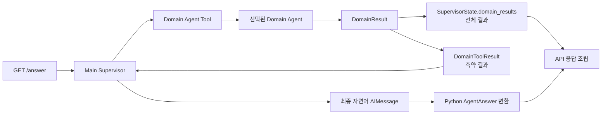

# Main Supervisor와 도메인 Agent Tool 구조를 채택

## 배경

연금 질의응답은 업무·제도, 세제·수령, 상품·운용처럼 책임과 필요한 도구가 다른
영역을 함께 다룬다. 하나의 에이전트에 검색, 계산과 답변 조립을 모두 맡기면 도메인
경계가 흐려지고 팀원이 각 영역을 독립적으로 개발하기 어렵다.

평가 API는 stateless `GET /answer`이며 응답 필드가 정확히 5개로 고정되어 있다.
또한 제공 문서만 답변 근거로 사용하고, 확정 수치는 Python 함수가 계산해야 한다.
따라서 LLM에 전달할 도메인 결론과 API 조립·검증에 필요한 전체 근거 및 계산 기록을
분리해서 보관할 실행 구조가 필요하다.

## 결정

### 실행 구조

상위 오케스트레이터는 `create_agent` 기반 Main ReAct Supervisor로 구현한다. Main은
질문을 분석해 필요한 도메인만 고르고 다음 세 Agent를 각각 Tool로 호출한다.

| 도메인 | 책임 |
|---|---|
| 업무·제도 (`policy`) | 가입·이전·해지·수령 절차와 제도상 가능 여부 |
| 세제·수령 (`tax_payout`) | 세액공제·과세·수령 조건과 Python 함수의 확정 계산 |
| 상품·운용 (`product`) | 상품 특성·비용·위험·유동성과 동일 기준의 비교 |

`Domain Agent Tool`은 Main과 서브에이전트 사이의 도구 함수다. 별도 LLM이나 독립
상위 노드가 아니며, LangGraph의 제어권 이전 패턴인 Handoff도 사용하지 않는다.
Tool은 서브에이전트를 실행하고 한 번의 호출에서 다음 두 출력을 함께 만든다.

- 전체 `DomainResult`는 `SupervisorState.domain_results`에 누적해 근거, 계산 추적과
  API 응답 조립에 사용한다.
- Evidence 원문과 전체 계산 기록을 제외한 `DomainToolResult`만 `ToolMessage`로
  Main LLM에 전달한다.
- State의 사용자 정의 필드는 프롬프트에 자동으로 포함하지 않는다.
- Main은 MVP에서 최종 답변에 필요한 Tool만 호출하며 탐색적·중복 호출은 하지 않는다.

각 도메인 Agent의 내부는 ReAct, Retrieval Workflow, 별도 LangGraph 또는 고정 Python
Workflow 중 적합한 방식을 독립적으로 선택할 수 있다. 다만 공통 입출력 계약과 책임
경계는 지켜야 한다. LLM을 사용하는 모든 경로는 `PROJECT_RULES.md`의 HyperCLOVA X
제한을 따른다.

### 공통 실행 계약

Main과 도메인 Agent 사이의 계약은 `DomainRequest -> DomainResult`로 고정한다.
최소 공통 타입의 책임은 다음과 같다.

| 타입 | 책임 |
|---|---|
| `DomainRequest` | 질문 원문과 하나의 구체적인 비즈니스 판단인 `objective` 전달 |
| `DomainDecision` | 판단 상태, 조건을 포함한 결론과 누락 조건 전달 |
| `EvidenceChunk` | 결론에 실제 사용한 문서 청크와 원본 위치 보관 |
| `CalculationResult` | Python 계산 함수명, 입력, 결과와 단위 보관 |
| `DomainResult` | 도메인의 전체 판단·근거·계산·경고·정제된 오류 보관 |
| `DomainToolResult` | Main LLM에 필요한 판단·경고·정제된 오류만 전달 |
| `AgentAnswer` | Main LLM이 생성한 최종 자연어 `answer`만 보관 |
| `SupervisorState` | 질문과 실행된 전체 `DomainResult`를 요청 수명 동안 보관 |

Main LLM은 Tool 요청에서 하나의 판단 목표인 `objective`만 생성한다. Tool Adapter는
`SupervisorState.question`의 사용자 원문과 `objective`를 결합해 `DomainRequest`를
만들며, 모델이 사용자 질문을 요약하거나 조건을 추가한 값은 도메인 Agent에 전달하지
않는다.

실행 상태와 비즈니스 판단 상태를 분리한다.

- `execution_status`는 `completed`, `failed`, `timeout` 중 하나다.
- `decision.status`는 `determined`, `conditional`, `undetermined`,
  `not_applicable` 중 하나다.
- 제도상 불가능하다는 결론도 분석을 정상 수행했다면 `completed`다.
- `completed`에는 `decision`이 있고 기술 `error`가 없어야 한다.
- `failed`와 `timeout`에는 정제된 `error`가 있고 `decision`이 없어야 하며,
  `evidence`와 `calculations`는 비어 있어야 한다.
- `determined`와 `not_applicable`의 `missing_conditions`는 비어 있어야 한다.
- `conditional`과 `undetermined`에는 구체적인 `missing_conditions`가 있어야 한다.
  API가 stateless이므로 재질문하지 않고 최종 답변 안에서 조건별 결론을 설명한다.

하나의 `DomainRequest.objective`에는 하나의 비즈니스 판단만 넣는다. 복합 질문은
Main이 여러 요청으로 나누며, Agent는 질문에 없는 조건이나 값을 추정하지 않는다.
자신의 책임 밖의 판단이 필요하면 임의로 결론을 만들지 않고 `warnings`에 의존성을
남긴다.

### 근거, 계산과 API 응답

확정 세금·금액·세율·한도는 LLM이 생성하지 않고 Python 계산 함수의 결과만 사용한다.
도메인 Agent는 검색 top-k 전체가 아니라 결론에 실제 사용한 청크만 `evidence`에
포함한다.

API 조립 대상은 `execution_status == completed`이면서 `decision.status`가
`not_applicable`이 아닌 결과다. `CalculationResult`는 확정 수치의 출처 검증에
사용하고 평가 API에는 직접 노출하지 않는다.

Main LLM은 `DomainToolResult`의 결론과 조건을 통합해 최종 자연어 메시지를 생성한다.
애플리케이션은 마지막 자연어 `AIMessage`를 Pydantic `AgentAnswer`로 검증해 변환한다.
Function Calling과 Structured Outputs를 같은 요청에 결합하지 않으며, 구체적인
HyperCLOVA X 모델은 Factory 외부에서 주입한다. API 조립 코드는 `AgentAnswer`와
`SupervisorState`를 다음과 같이 평가 API의 정확한 5개 필드로 변환한다.

| API 필드 | 출처와 생성 방식 |
|---|---|
| `question_id` | `SupervisorState.question_id`를 그대로 전달 |
| `question` | 질문 원문을 그대로 전달 |
| `retrieved_context` | 답변에 반영된 완료 결과의 `EvidenceChunk`만 직렬화 |
| `think_trace` | 실제 도메인 호출·실행·판단·누락 조건을 State에서 안전한 문장으로 변환 |
| `answer` | `AgentAnswer.answer`를 전달 |

`think_trace`는 LLM의 내부 사고 과정이나 원시 Tool 로그가 아니다. 원시 예외,
stack trace, DB 주소, 내부 경로와 모델 내부 메시지는 별도 관측 로그에서 관리하고
응답에 노출하지 않는다.

질문의 사용자 조건은 별도 `UserFact`로 추출하지 않고 원문으로 전달한다. MVP에는
로그인, 사용자 식별, 사용자 프로필과 장기 메모리를 도입하지 않는다.

다음 기능은 현재 구조에 포함하지 않고 필요성과 계약을 별도 결정으로 다룬다.

- 의미 단위 결과 통합을 담당하는 Result Aggregator
- Claim과 근거의 연결을 검사하는 Evidence Validator
- 명시적 Router 및 사용자 조건 추출 노드
- 도메인별 재시도와 재라우팅
- 탐색적·중복 호출 결과를 선택하기 위한 결과 ID

## 고려한 대안

- 단일 에이전트가 모든 도메인을 직접 처리하면 초기 연결은 단순하지만 책임 경계,
  도구 선택과 도메인별 병렬 개발이 어려워 채택하지 않았다.
- Handoff로 서브에이전트에 제어권을 넘기면 대화 주체와 State 소유권이 바뀐다. 이번
  API는 Main이 최종 답변을 통합하고 전체 실행 결과를 일관되게 조립해야 하므로
  Agent를 Tool로 호출하는 방식을 선택했다.
- 명시적 Router, Aggregator와 Validator를 처음부터 별도 노드로 두면 확장 지점은
  분명하지만 MVP에서 계약과 장애 지점이 불필요하게 늘어나므로 보류했다.
- 전체 `DomainResult`를 Main LLM에 전달하면 구현은 단순하지만 근거 원문과 계산
  기록이 모델 컨텍스트를 늘리고 불필요한 재해석을 유도하므로 채택하지 않았다.
- 사용자 조건과 프로필을 먼저 구조화하면 개인화에는 유리하지만 stateless 평가
  인터페이스와 현재 요구 범위를 넘어가므로 도입하지 않았다.

## 결과

- 팀원은 공통 계약을 기준으로 세 도메인 Agent를 독립적으로 개발하고 교체할 수 있다.
- Main LLM의 컨텍스트는 답변 작성에 필요한 축약 결론으로 제한되고, 근거와 계산의
  원본은 결정론적인 API 조립·검증 경로에 남는다.
- Main Agent의 Function Calling 요청은 Provider별 Structured Outputs 지원 차이에
  의존하지 않고, 최종 자연어 메시지는 애플리케이션 계약으로 변환된다.
- 검색 근거, 확정 계산과 사용자 답변의 출처를 `DomainResult`에서 추적할 수 있다.
- Tool이 `DomainResult`의 State 누적과 `DomainToolResult` 메시지 생성을 함께 책임하므로
  두 결과가 불일치하지 않도록 계약 테스트가 필요하다.
- 도메인 내부 자유도가 큰 대신 공통 상태 조합, 필수 필드와 책임 경계를 테스트로
  강제해야 한다.
- 탐색적 호출, 결과 충돌, 자동 재시도나 근거 의미 검증이 필요해지면 현재 단순 조립
  규칙만으로는 부족하므로 후속 ADR로 확장해야 한다.

## 관련 자료

- [연금 AI 멀티에이전트 MVP 아키텍처 및 스키마](https://app.notion.com/p/3b96ebf026ac80009ab6e0be36d246cb?source=copy_link)
- [확인 가능한 작업 사본](https://app.notion.com/p/3b9522d1a920800ea574ca8eb703aa8f?pvs=204)
- [HTTP 인터페이스 모듈 결정](20260803-api-interface-module.md)
- [모듈 의존성 방향 결정](20260803-module-dependency-direction.md)
- [`GET /answer` API 명세](../api-spec.md)
