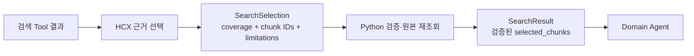

# Search Agent의 근거 선택 책임과 결과 계약을 채택

## 배경

검색 Tool은 Python dict를 관례적인 JSON 문자열로 직렬화할 뿐 명시적인 출력 스키마가
없었다. Agent의 자유 형식 `AIMessage`에서도 실제 선택한 청크를 Domain Agent가 안전하게
사용할 수 없었다.

HCX-005는 Function calling을 지원하지만 Structured Outputs는 지원하지 않는다. 따라서
검색 Tool 호출과 최종 근거 선택을 하나의 Structured Outputs 응답으로 강제하지 않는다.

## 결정

### 책임 경계

Search Agent는 다음 검색 판단만 담당한다.

- 판단 목표에 맞는 검색어와 검색 방식 선택
- 검색 후보의 관련성 비교와 인접 문맥 확인
- 중복 후보 제거, 실제 사용할 청크 선택과 근거 충족도 구분
- 확인하지 못한 검색 범위를 `limitations`로 전달

Search Agent는 제공 자료가 의미하는 제도·세제·상품 결론을 내리거나 결정론적 계산을
수행하지 않는다. 이 책임은 선택된 청크를 받는 Domain Agent와 `rules`에 있다.

### Tool 응답 계약

검색 Tool이 HCX에 반환하는 JSON은 다음 Pydantic 계약을 먼저 통과한다.

| 계약 | 사용 Tool |
|---|---|
| `SearchHitsPayload` | `search_chunks`, `search_within_document` |
| `NeighborChunksPayload` | `get_neighbor_chunks` |
| `GetChunkPayload` | `get_chunk` |
| `SearchToolErrorPayload` | 모든 검색 Tool의 정제된 실패 |

공통 `SearchChunkPayload`에는 `chunk_id`, 문서 메타데이터와 본문만 포함한다. 청크 ID는
UUID로 검증하고 Tool 출력의 추가 필드를 금지한다.

### HCX 선택과 Python 결과 분리

HCX가 생성하는 값과 Python이 신뢰할 수 있는 결과를 분리한다.

`SearchSelection`은 후속 terminal Tool의 Function calling 입력 계약이다. HCX는 검색
후보의 `chunk_id`만 선택하며 원본 파일명, 위치와 본문을 다시 생성하지 않는다.

`SearchResult`는 Python만 생성한다. 선택한 ID를 검색 후보와 대조하고 원본 청크를 다시
조회한다. Domain Agent는 LangGraph 메시지가 아닌 `SearchResult`만 사용한다.

### 상태 조합

| execution_status | coverage | selected_chunks | error |
|---|---|---|---|
| `completed` | `sufficient` 또는 `partial` | 1개 이상 | 없음 |
| `completed` | `none` | 빈 목록 | 없음 |
| `failed` 또는 `timeout` | 없음 | 빈 목록 | 정제된 오류 필수 |

`coverage=none`은 검색이 정상 완료됐지만 관련 근거가 없다는 뜻이며 기술 실패와 구분한다.

## 결과

- Tool 응답의 JSON 모양이 실행 시 검증된다.
- Search Agent의 판단 범위가 근거 관련성과 충족도로 제한된다.
- HCX-005의 Structured Outputs에 의존하지 않고 Function calling으로 최종 선택을 받을 수
  있는 계약이 생긴다.
- 후속 구현에서 검색 후보를 State에 누적하고 terminal Tool이 `SearchResult`를 만드는
  실행 흐름을 추가해야 한다.

이번 결정은 계약과 기존 Tool 직렬화까지만 적용한다. terminal Tool, 후보 State 누적,
Domain Agent 연결과 timeout 실행 정책은 별도 변경으로 구현한다.

## 관련 자료

- [CLOVA Studio 모델](https://guide.ncloud-docs.com/docs/clovastudio-model)
- [CLOVA Studio LangChain 연동](https://guide.ncloud-docs.com/docs/clovastudio-dev-langchain)
