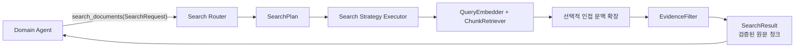

# Router 기반 결정론적 Search Service를 채택

## 배경

Domain Agent에는 제공 문서 근거를 요청하는 `search_documents` Tool 하나만 노출되어
있지만, 그 내부는 HCX 기반 ReAct Search Agent가 검색 Tool과
`submit_search_result`를 반복 선택하는 구조였다. 검색 후보를 확보하고도 HCX가 최종
제출 Tool 대신 자연어 또는 JSON 본문을 출력하면 결과 상태가 완성되지 않았고, 교정
메시지와 전체 청크 본문이 누적되면서 모델 호출, 토큰과 지연시간이 증가했다.

검색 계층의 책임은 검색 방법 선택과 제공 문서 청크 조회다. 자연어 답변, 제도·세제·상품
판단과 근거 충분성 판단은 Domain Agent의 책임이므로, 검색 과정 자체에 개방형 ReAct
루프와 별도 LLM 판단을 둘 필요가 없다.

## 결정

### 책임 경계

Domain Agent의 검색 Tool 개수는 하나로 유지하고 내부 구현을 규칙 기반 Router와
결정론적 Search Service로 교체한다.

| 구성요소 | 책임 |
|---|---|
| Domain Agent | 필요한 판단 목표와 신뢰할 수 있는 의미 힌트 전달, 반환 근거로 업무 판단 |
| Search Router | 입력을 검증하고 최초 검색 경로를 정확히 한 번 선택 |
| Search Strategy Executor | 계획에 지정된 embedding·검색·조회 연산 실행 |
| Search Service | permission에서 필터를 생성하고 route별 반환값의 권한·provenance 재검증 |
| EvidenceFilter | 검증된 후보의 중복 제거, 안정 순서, cutoff와 최종 개수 적용 |
| SearchResult | Python이 검증한 원문 청크, provenance, 제한과 정제 오류 전달 |

Search 계층은 자연어 답변, 업무 결론, 수치 계산과 의미적 근거 충분성 판단을 수행하지
않는다. Domain Agent는 Qdrant 모드, top-k, score cutoff와 재시도 횟수를 직접 제어하지
않는다.

### 요청과 계획 계약

`search_documents`는 하나의 `SearchRequest`를 받고 `SearchResult`를 반환한다.
`SearchRequest`에는 다음 의미 정보만 허용한다.

- `objective`: 비어 있지 않은 하나의 근거 검색 목표
- `source_file_name`: 사용자가 제공했거나 신뢰 상태에서 확인한 원본 문서 힌트
- `chunk_id`: 신뢰 상태에서 확인한 UUID 청크 ID
- `expand_neighbors`: 앞뒤 구조 문맥이 필요한지 여부

`permission`은 모델 입력이 아니라 기존과 같이 신뢰된 Domain 호출 경계에서 주입한다.
Search Service는 permission을 검증해 허용 문서 유형을 계산한다. Router는 요청·허용 문서 유형·설정으로 경로, 검색문, 모드, 문서 유형 필터, 후보 수와
인접 확장 여부를 담은 불변 `SearchPlan`을 만든다. 같은 요청과 설정은 같은 계획을
생성하며 Router는 검색 결과를 받아 재진입하지 않는다.

최초 경로는 다음 우선순위를 따른다.

| 조건 | 경로 | 기본 모드 |
|---|---|---|
| 검증된 `chunk_id` | `get_chunk` | embedding 없음 |
| 검증된 `source_file_name` | `search_within_document` | `hybrid` |
| 그 외 | `search_chunks` | `hybrid` |

서로 모순되는 힌트, 잘못된 UUID와 권한 위반은 Provider 호출 전에 실패시킨다.
`get_neighbor_chunks`는 최초 경로가 아니며 `expand_neighbors`가 설정된 경우에만 최초
경로의 권한 검증된 최상위 후보 한 개를 기준으로 최대 한 번 실행한다. 한 요청의 최초
검색도 최대 한 번이다.

Dense·Sparse 전용 자동 분류와 검색어 재작성은 이번 결정에 포함하지 않는다. 필요성이
평가로 확인되면 별도 결정으로 추가한다.

### EvidenceFilter와 결과 계약

Retriever가 반환한 후보는 곧바로 Domain Agent에 전달하지 않는다. EvidenceFilter가
다음을 순서대로 적용한다.

1. Search Service가 permission에 허용된 문서 유형과 route별 provenance를 재검증
2. EvidenceFilter가 `chunk_id` 기준 중복 제거
3. 검색 점수의 안정 순서 유지와 버전 관리된 cutoff 적용
4. 후보 수와 별도로 설정된 최종 전달 개수 적용
5. 요청된 경우에만 anchor를 보존하며 같은 문서의 인접 청크를 문서 순서로 결합

score cutoff와 최종 개수는 평가 결과를 근거로 불변 설정에서 버전 관리한다. 검증되지
않은 cross-encoder나 새 모델을 도입하지 않으며, top-k 전체를 그대로 반환하지 않는다.
점수가 없는 `get_chunk` 결과와 인접 청크에는 검색 점수 cutoff를 적용하지 않고 권한,
provenance, 중복과 최종 개수 계약을 적용한다.

`SearchResult`는 다음 값만 갖는다.

- `execution_status`: `completed`, `failed`, `timeout`
- `retrieved_chunks`: 원문 `content`, `chunk_id`, source, title과 locator를 보존한 청크
- `limitations`: 완료했지만 확인하지 못한 검색 범위
- `error`: 실패 또는 시간 초과 시의 정제된 오류

완료된 검색은 청크가 없을 수 있다. 이 경우 Domain Agent가 외부 지식으로 보충하지 않고
근거 부족 판단을 만든다. 기존 `coverage`는 SearchResult에서 제거하며, 충분성은 Domain
Agent의 `decision.status`, `missing_conditions`와 `warnings`로 표현한다. 실패와 시간
초과 결과에는 청크를 포함하지 않고 정제된 `error`를 필수로 둔다.

### 실행과 운영 계약

- Search Service는 HCX를 호출하지 않는다.
- Search Agent 전용 graph, prompt, middleware, state와 `submit_search_result`를 제품
  실행 경로에서 제거한다.
- Domain의 absolute deadline을 연장하지 않으며 capacity 대기, embedding과 Qdrant
  호출을 같은 deadline 안에 둔다.
- 외부 취소를 하위 coroutine에 전파하고 검색 capacity를 반환한다.
- 기존 process-wide embedding·Qdrant 동시성 제한을 재사용한다.
- permission을 모든 검색, 직접 조회와 인접 조회에 동일하게 적용한다.
- Provider와 Qdrant의 원시 예외, 내부 주소와 인증 정보를 결과에 노출하지 않는다.
- route, 선택 청크 ID, 상태, 지연시간과 정제 오류만 구조화 로그에 남긴다.

Domain Agent의 `search_documents` 단일 Tool과 `/answer`의 5개 필드 외부 계약은 바꾸지
않는다. Domain의 최종 제출 Tool은 `evidence_chunk_ids`로 SearchResult의 부분집합만
선택하고 Python이 UUID·중복·부분집합을 검증한다. `retrieved_context`에는 이렇게 Domain
판단에 실제 사용된 근거만 포함한다.

## 고려한 대안

### ReAct Search Agent 유지

검색 결과를 본 HCX가 다음 Tool과 최종 근거를 유연하게 선택할 수 있다. 하지만 최종
제출 Tool 미호출, 자유 형식 교정 루프, 청크 본문 재주입과 호출 상한까지 반복되는 비용을
제거하지 못하므로 채택하지 않았다.

### 단일 호출 LLM Router

ReAct보다 모델 호출을 줄이면서 검색어와 모드를 동적으로 만들 수 있다. 그러나 검색
시작 전부터 모델 quota, Function calling 형식과 지연시간에 의존하며 같은 입력의 실행
계획도 고정되지 않는다. 현재 세 경로는 검증 가능한 힌트만으로 구분할 수 있어 채택하지
않았다.

### 하나의 고정 Hybrid 검색

구현은 가장 단순하지만 이미 확인된 문서나 청크도 전체 corpus에서 다시 검색하고
불필요한 embedding을 수행한다. 신뢰된 힌트를 안전하게 활용하면서 실행을 bounded하게
유지할 수 있는 규칙 Router를 채택했다.

### Domain Agent에 저수준 검색 Tool 공개

Domain Agent가 검색 방식을 직접 선택할 수 있지만 ReAct 제어 문제와 검색 설정 결합이
한 단계 위로 이동한다. Domain에는 의미 목표만 노출하고 검색 기술 선택을 중앙화한다.

## 결과

- 검색 요청당 Search 계층의 HCX 호출은 0회가 된다.
- 최초 검색 1회와 선택적 인접 확장 1회로 실행 경로와 비용이 고정된다.
- `submit_search_result` 미호출로 구조화 결과가 사라지는 실패 경로가 제거된다.
- 권한, provenance, cutoff와 결과 조립의 신뢰 경계가 Python 코드에 남는다.
- 검색어 재작성과 HCX의 의미적 후보 선택이 사라지므로 검색 precision·recall을 평가
  baseline과 비교해야 한다.
- `coverage` 제거는 Domain 결과 생성 규칙과 계약 테스트를 함께 변경해야 한다.
- accepted Search Agent 결과 계약은 이 결정으로 대체하지만 기록 자체는 보존한다.

## 관련 자료

- [GitHub issue #80](https://github.com/nayeon653/-ace3/issues/80)
- [Agent용 Qdrant 검색 함수 명세](../retrieval/qdrant-search-functions.md)
- [Qdrant retrieval 계약](../qdrant-retrieval-spec.md)
- [온라인 Agent native async 결정](20260819-agent-runtime-native-async.md)
