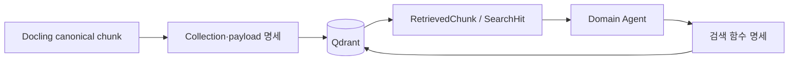

# Qdrant retrieval 계약

Docling 청크를 Qdrant에 저장하고 Agent가 검색하는 전체 계약의 진입 문서다. 저장 구조와
런타임 함수는 읽는 목적이 다르므로 상세 명세를 분리한다.

## 문서 안내

| 알고 싶은 내용 | 상세 문서 |
| --- | --- |
| Point·named vector·BM25·payload·index·Docling 매핑 | [Qdrant collection·payload 명세](retrieval/qdrant-index-spec.md) |
| Agent 검색 함수·입력·필터·반환·오류 | [Agent용 Qdrant 검색 함수 명세](retrieval/qdrant-search-functions.md) |
| 입력 검증·CLOVA 임베딩·Cloud 적재·재시작 | [Qdrant 인덱싱 실행](operations/qdrant-indexing.md) |
| 로컬 Qdrant 실행·중지·데이터 관리 | [로컬 Qdrant 실행과 확인](operations/qdrant-local.md) |

## 결정 요약

| 구분 | 결정 |
| --- | --- |
| Point ID | source chunk ID로 만든 결정적 UUIDv5. payload에 중복 저장하지 않음 |
| Dense vector | `dense`, CLOVA Studio `bge-m3`, 1,024차원, cosine |
| Sparse vector | `sparse`, Kiwi 전처리 + `qdrant/bm25`, IDF modifier |
| Hybrid 결합 | Query API의 RRF |
| 문서 식별 | `source_file_name` |
| 문서 분류 | `fund_prospectus`, `pension_reference` |
| 인용 본문 | `content` |
| 검색 입력 | `embedding_content` |
| 제목·위치 | `heading_path`, `page_numbers`에서 응답 시 파생 |
| 공개 검색 필터 | `source_file_name`, `document_type` |
| Agent 접근 권한 | Policy·Tax/Payout은 `pension_reference`, Product는 `fund_prospectus` |
| 구조 복원 | 같은 파일의 `chunk_index` 범위 조회 |

## 책임 경계

- `core`는 Qdrant를 모르는 검색 입력·결과·오류 타입을 소유한다.
- `retrieval`은 Qdrant 요청 생성, 필터 변환, payload 검증과 결과 변환을 소유한다.
- `agent.search`는 공용 검색 타입과 `ChunkRetriever` Port만 사용한다.
- 각 Domain Agent는 도메인 이름인 `Permission`을 상태에 넣고, 중앙 매핑으로 검색 문서군을 제한한다.
- 온라인 Agent에서는 `retrieval`의 `AsyncQdrantChunkRetriever`가 async Port를 구현한다.
  `QdrantChunkRetriever`는 오프라인 적재 검증과 동기 도구에서 같은 계약을 유지한다.
- Qdrant SDK 타입은 `pension_agent/retrieval/` 밖으로 노출하지 않는다.
- `content`만 답변 근거로 사용하고 `embedding_content`는 외부 응답에 노출하지 않는다.

범용 Repository 계층은 두지 않는다. Search Agent가 실제 저장소 구현에 의존하지 않도록
필요한 네 검색 연산만 `ChunkRetriever` Protocol로 정의한다. 검색 입력은 Query Object,
payload 조건은 Filter Builder, Qdrant 접근은 Retriever Adapter로 구성한다.

## 현재 범위 밖

- 청크 크기·overlap과 파싱·청킹 구현
- collection 삭제·schema migration 자동화
- 평가셋으로 검증되지 않은 weighted RRF·formula
- positive·negative point 계약이 없는 recommend·discovery
- 정확성과 사용 목적이 확인되지 않은 `element_types` 검색 필터

## 관련 자료

- [문서 파싱 운영](operations/document-parsing.md)
- [Qdrant 공식 문서](https://qdrant.tech/documentation/)
- [GitHub 이슈 #33](https://github.com/nayeon653/-ace3/issues/33)
- [GitHub 이슈 #42](https://github.com/nayeon653/-ace3/issues/42)
