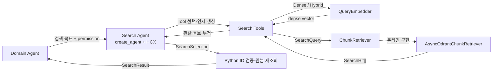

# Agent용 Qdrant 검색 함수 명세

Domain Agent가 Qdrant SDK 타입을 직접 다루지 않고 제공 문서를 검색하는 런타임 계약이다.
전체 결정과 저장 스키마는 다음 문서를 기준으로 한다.

- [Qdrant retrieval 계약](../qdrant-retrieval-spec.md)
- [Qdrant collection·payload 명세](qdrant-index-spec.md)

## 공개 진입점

제품 `/answer` 경로에서는 `AsyncQdrantChunkRetriever`가 async `ChunkRetriever` Port를
구현한다. 기존 `QdrantChunkRetriever`는 오프라인 적재 검증과 동기 도구에서 계속
사용하며, 온라인 Agent에는 주입하지 않는다.

| 함수 | 목적 | Qdrant 호출 | 반환 |
| --- | --- | --- | --- |
| `await search_chunks(query, filters=None, limit=10)` | 전체 corpus의 Dense·Sparse·Hybrid 검색 | `await query_points` | `list[SearchHit]` |
| `await search_within_document(query, source_file_name, document_types=None, limit=10)` | 파일·문서군으로 제한한 검색 | `await query_points` | `list[SearchHit]` |
| `await get_neighbor_chunks(request, document_types=None)` | 허용된 문서군 안에서 앞뒤 청크 복원 | `await scroll` | `list[RetrievedChunk]` |
| `await get_chunk(chunk_id, document_types=None)` | UUID로 허용된 청크 하나 재조회 | `await retrieve` | `RetrievedChunk | None` |

온라인 생성자는 연결된 `AsyncQdrantClient`, 비어 있지 않은 collection 이름과 1~100
범위의 `prefetch_limit`을 받는다. 기본 prefetch 후보 수는 30이다.

Domain Agent는 `create_search_agent(model, embedder, retriever)`로 만든 Search Agent에
근거 검색 목표를 전달한다. Factory는 `create_agent`에 주입된 HCX 모델과 다음
Tool을 바인딩한다.

| Tool | Agent가 사용하는 시점 |
| --- | --- |
| `search_chunks` | 전체 제공 문서에서 첫 후보를 찾을 때 |
| `search_within_document` | 이미 확인한 원본 문서 안에서 추가 후보를 찾을 때 |
| `get_neighbor_chunks` | 선택한 청크의 앞뒤 문맥이 필요할 때 |
| `get_chunk` | 알고 있는 UUID 청크를 다시 검증할 때 |
| `submit_search_result` | 최종 검색 결과로 충족도, 선택 ID와 한계를 제출할 때 |

`submit_search_result`는 **최종 검색 결과 제출 Tool**이며 셸 터미널이나
명령행 터미널을 뜻하지 않는다. HCX는 이 Tool에 `SearchSelection`을 Function
calling으로 제출한다. Python은 선택 ID가 이번 실행의 검색 Tool 후보에
있는지 확인하고, 같은 permission으로 `get_chunk`를 수행해 Qdrant 원본을 다시
읽은 뒤에만 `SearchResult`를 만든다. Domain Agent는 Search Agent의 자유 형식
메시지를 파싱하지 않는다.

Domain Agent는 요청마다 자신의 도메인 이름인 `Permission`을 GraphState에 주입한다.
Search Agent는 질문과 이전 Tool 결과를 보고 다음 Tool, 검색어, 검색 방식과 허용 범위
안의 추가 필터를 선택한다. Tool 내부의 결정론적 실행부는 Dense·Hybrid 검색문만 `QueryEmbedder`로
임베딩하고 공용 `SearchQuery`를 만든 뒤 `ChunkRetriever`에 위임한다. Sparse 검색과
청크 조회는 임베더를 호출하지 않는다. 첫 모델 호출은 `tool_choice=required`로 검색
Tool 사용을 강제한다. 기본 프로필은 한 요청의 모델 호출을 4회, 검색 Tool 호출을
3회로 제한한다.



## Agent 문서 접근 권한

| Domain Agent | 허용 문서 유형 |
| --- | --- |
| Policy | `pension_reference` |
| Tax/Payout | `pension_reference` |
| Product | `fund_prospectus` |

`permission`은 LLM Tool 인자가 아니라 신뢰된 호출자가 `SearchAgentState`에 주입하는
필수 필드다. Search Agent는 첫 모델 호출 전에 이 값을 검증하며, 누락되거나 형식이
잘못되면 모델과 검색을 실행하지 않고 명시적인 권한 오류로 종료한다. `search_chunks`의
선택적 `document_type` 인자는 권한을 좁힐 수만 있고 넓힐 수 없다.

```python
result = await search_adapter.search(objective, permission=Permission.POLICY)
```

검색 Tool은 권한에서 허용된 문서 유형을 Qdrant payload filter에 포함해 Dense, Sparse,
Hybrid 후보를 만들기 전에 corpus를 제한한다. Retriever가 필터를 지키지 않는 구현으로
교체되거나 저장 데이터가 잘못된 경우를 대비해 반환 청크의 `document_type`도 다시
검증한다. 파일명 검색, 인접 조회와 chunk ID 재조회에도 같은 권한을 적용한다.

`QueryEmbedder`와 `ChunkRetriever`는 Protocol이므로 Agent 계층에 Qdrant SDK나 특정
임베딩 SDK 타입을 노출하지 않는다. 임베딩 제공자가 예외를 반환하거나 유효하지 않은
vector를 반환하면 Tool 결과의 정제된 `error`로 전달한다. Qdrant 요청·데이터 오류도
원시 예외 대신 기존 retrieval 오류 계약의 안전한 메시지로 전달한다. 제품 실행에서는
`PROJECT_RULES.md`에 따라 HCX-005 모델만 Factory에 주입한다.

## Search Agent 설정

`config/search_agent.py`의 `SearchAgentConfig`는 허용할 필드와 범위, 필드 간 검증을
정의한다. `config/defaults/search_agent.py`의 `DEFAULT_SEARCH_AGENT_CONFIG`는 저장소가
현재 선택한 버전 관리 기본 프로필이다. 따라서 설정 구조를 바꾸는 일과 평가 결과에
따라 기본값을 조정하는 일을 분리할 수 있다.

| 설정 | 기본값 | 목적 |
| --- | --- | --- |
| `max_model_calls` | `6` | 검색 3회, 최종 제출과 HCX 형식 교정을 포함한 모델 호출 상한 |
| `max_tool_calls` | `3` | 한 요청의 검색 Tool 호출 상한. 최종 결과 제출은 제외 |
| `max_concurrency` | `4` | 프로세스에서 동시에 실행할 Search Agent 상한 |
| `timeout_seconds` | `45` | Domain Adapter가 Search Agent 전체 실행을 기다리는 상한 |
| `default_search_mode` | `hybrid` | 검색 Tool의 기본 검색 방식 |
| `default_result_limit` | `10` | 검색 Tool의 기본 결과 수 |
| `default_neighbor_before` | `1` | 인접 조회의 기본 앞쪽 청크 수 |
| `default_neighbor_after` | `1` | 인접 조회의 기본 뒤쪽 청크 수 |

Factory에 별도 설정을 넘기지 않으면 이 기본 프로필을 사용한다. 실험이나 테스트에서는
검증된 `SearchAgentConfig`를 `create_search_agent(..., config=...)`에 주입해 동작을
바꿀 수 있다. 결과 수 최대 100개, 인접 조회 합계 최대 100개, 원시 Provider·Retriever
오류 정제는 운영 안전 계약이므로 프로필로 완화할 수 없다.

인접 청크 조회는 `before + after + 1 <= 100`을 공용 `NeighborRequest`와 Tool 실행
경계에서 함께 검증한다. 합계를 넘는 요청은 Retriever를 호출하지 않는다.

## 입력 계약

### SearchQuery

| 필드 | 계약 |
| --- | --- |
| `text` | 앞뒤 공백 제거 후 비어 있지 않은 검색문 |
| `dense` | Dense·Hybrid에서 필수인 유한 실수 vector. Sparse에서는 생략 가능 |
| `mode` | `dense`, `sparse`, `hybrid`. 기본값은 `hybrid` |

### SearchFilters

| 필드 | Qdrant 조건 |
| --- | --- |
| `source_file_name` | keyword `MatchValue` |
| `document_types` | 한 값은 keyword `MatchValue`, 여러 값은 `MatchAny` |

두 값이 함께 있으면 `must`로 결합해 모두 만족하는 Point만 검색한다. 필터가 없으면
`None`을 전달해 전체 corpus를 검색한다. `element_types`는 payload에 보존하지만
정확성과 Agent 사용 목적을 검증하기 전에는 검색 매개변수로 제공하지 않는다.

### NeighborRequest

| 필드 | 계약 |
| --- | --- |
| `source_file_name` | 기준 청크와 동일한 비어 있지 않은 파일명 |
| `chunk_index` | 0 이상의 기준 청크 순서 |
| `before`, `after` | 각각 0 이상의 앞뒤 범위. 기본값은 1 |

인접 조회 범위는 기준 청크를 포함하며 시작값은 0보다 작아지지 않는다. 반환 결과는
`chunk_index` 오름차순이다. `before + after + 1`은 공통 조회 상한인 100 이하여야 한다.

## 출력 계약

`SearchHit`는 검증된 `RetrievedChunk`와 Qdrant 검색 점수를 함께 반환한다.
`RetrievedChunk`는 Qdrant SDK 타입을 제거하고 다음 정보를 제공한다.

- 안정 UUID `chunk_id`
- 원본 파일명·형식과 문서 유형
- 문서 내 `chunk_index`
- 인용 가능한 `content`
- 제목 계층·캡션·요소 유형·페이지 provenance
- 응답용으로 파생한 `title`과 `locator`

## 검색 결과 변환

| API 필드 | 변환 규칙 |
| --- | --- |
| `chunk_id` | `str(point.id)` |
| `source_file_name` | `payload.source_file_name` |
| `title` | `heading_path[-1]`, 없으면 파일명 stem |
| `locator` | 페이지, 제목, `chunk_index` 순으로 파생 |
| `content` | `payload.content` |

```python
def make_locator(
    page_numbers: list[int],
    heading_path: list[str],
    chunk_index: int,
) -> str:
    pages = sorted(set(page_numbers))

    if len(pages) == 1:
        return f"{pages[0]}페이지"
    if pages and pages == list(range(pages[0], pages[-1] + 1)):
        return f"{pages[0]}–{pages[-1]}페이지"
    if pages:
        return ", ".join(f"{page}페이지" for page in pages)
    if heading_path:
        return f"{heading_path[-1]} 절"
    return f"문서 내 청크 {chunk_index + 1}"
```

`embedding_content`와 내부 metadata는 평가 API에 노출하지 않는다.

## 검색 접근 계약

Qdrant SDK 타입은 `pension_agent/retrieval/` 밖으로 노출하지 않는다. 공용 타입은
`core`에 두고 `retrieval`에서 SDK 타입으로 변환한다. 구현은 DB 교체를 위한 추상
Repository를 추가하지 않고 다음 세 패턴만 사용한다.

- **Query Object**: `SearchQuery`, `SearchFilters`, `NeighborRequest`가 입력을 검증한다.
- **Filter Builder**: 허용된 세 payload index만 Qdrant 조건으로 변환한다.
- **Port/Adapter**: 온라인 Agent의 async `ChunkRetriever` Port를
  `AsyncQdrantChunkRetriever`가 구현한다.

```python
query = SearchQuery(
    text="IRP 중도해지 절차",
    dense=(0.12, -0.34, 0.56),
    mode=SearchMode.HYBRID,
)
filters = SearchFilters(
    document_types=frozenset({DocumentType.PENSION_REFERENCE}),
)
```

```python
retriever = AsyncQdrantChunkRetriever(
    client,
    collection_name="pension_documents",
)

hits = await retriever.search_chunks(
    query,
    filters=filters,
    limit=10,
)

document_hits = await retriever.search_within_document(
    query,
    source_file_name="guide.pdf",
    document_types=frozenset({DocumentType.PENSION_REFERENCE}),
    limit=10,
)

neighbors = await retriever.get_neighbor_chunks(
    NeighborRequest(
        source_file_name="guide.pdf",
        chunk_index=7,
        before=1,
        after=1,
    ),
    document_types=frozenset({DocumentType.PENSION_REFERENCE}),
)

chunk = await retriever.get_chunk(
    "550e8400-e29b-41d4-a716-446655440000",
    document_types=frozenset({DocumentType.PENSION_REFERENCE}),
)
```

`SearchMode`는 `dense`, `sparse`, `hybrid`를 지원하며 기본값은 `hybrid`다. Hybrid
검색은 원문 질의를 dense embedding과 Kiwi token 문자열로 각각 변환한다. 같은 payload
filter로 두 결과를 prefetch한 뒤 RRF로 결합한다.

query embedding은 `aembed_query()`, Qdrant는 `AsyncQdrantClient`의 coroutine을
사용한다. 각 provider 호출은 프로세스 공용 limiter 안에서 실행한다. Kiwi tokenization은
요청 전에 prewarm하고, 검색 중에는 프로세스 수명의 단일 worker executor에서 실행해
event loop를 막지 않는다.

```python
sparse_text = await async_to_bm25_text(query.text)
await client.query_points(
    collection_name="pension_documents",
    prefetch=[
        models.Prefetch(
            query=models.Document(
                text=sparse_text,
                model="qdrant/bm25",
                options=BM25_OPTIONS,
            ),
            using="sparse",
            limit=30,
            filter=query_filter,
        ),
        models.Prefetch(
            query=query.dense,
            using="dense",
            limit=30,
            filter=query_filter,
        ),
    ],
    query=models.FusionQuery(fusion=models.Fusion.RRF),
    limit=10,
    with_payload=True,
    with_vectors=False,
)
```

- 결과는 RRF 점수 내림차순으로 반환한다.
- prefetch 30개와 최종 10개는 초기값이며 평가 결과로 조정한다.
- Hybrid에서 `to_bm25_text(query.text)`가 비어 있으면 sparse prefetch를 생략하고
  dense 검색만 수행한다.
- Sparse 전용 검색에서 전처리 결과가 비어 있으면 Qdrant를 호출하지 않고 빈 결과를
  반환한다.
- 인접 청크는 같은 파일에서 `chunk_index` 범위를 조회하고 오름차순으로 반환한다.
- 잘못된 UUID와 누락되거나 잘못된 payload는 retrieval 경계의 데이터 오류로 처리한다.

### Qdrant 기능 선택

Qdrant Query API가 제공하는 기능을 Agent에 그대로 노출하지 않고 현재 payload와 검색
평가 계획에 필요한 부분만 채택한다.

| 기능 | 상태 | 사용 위치 또는 보류 이유 |
| --- | --- | --- |
| dense nearest | 사용 | `SearchMode.DENSE`와 hybrid prefetch |
| sparse BM25 | 사용 | `SearchMode.SPARSE`와 hybrid prefetch |
| RRF hybrid | 기본 사용 | `SearchMode.HYBRID` |
| payload filter | 사용 | 파일명·문서 유형 제한 |
| point ID retrieve | 사용 | 이미 선택한 근거 재조회 |
| filter + scroll | 사용 | 같은 파일의 인접 청크 복원 |
| recommend·discovery | 보류 | positive·negative point 피드백 계약 없음 |
| grouping·order by 검색 | 보류 | 현재 Agent 검색 요구와 index 없음 |
| weighted RRF·formula | 보류 | 평가셋으로 가중치를 검증한 뒤 결정 |
| random sampling | 제외 | 답변 근거 검색 목적에 부적합 |

## 함수별 세부 동작

### search_chunks

1. Agent permission을 포함한 `SearchFilters`를 Qdrant filter로 변환한다.
2. 검색문을 Kiwi로 전처리해 Sparse BM25 입력을 만든다.
3. `SearchMode`에 맞는 Query API 요청을 만든다.
4. Qdrant payload를 검증한 뒤 `SearchHit`으로 변환한다.

`limit`은 1~100 범위다. 결과가 없으면 빈 목록을 반환한다.

### search_within_document

`source_file_name`과 허용된 `document_types`를 `SearchFilters`로 만들고
`search_chunks`에 위임한다.
별도 검색 알고리즘이나 결과 변환을 중복 구현하지 않는다.

### get_neighbor_chunks

같은 `source_file_name`, `chunk_index` 범위와 허용된 `document_types`를 `must`로
결합해 scroll한다.
벡터 유사도 검색은 수행하지 않으며 기준 청크를 포함한 구조 문맥을 복원한다.

### get_chunk

입력 UUID를 검증한 뒤 Point ID로 retrieve한다. Point가 없거나 조회된 청크가 허용된
문서 유형이 아니면 `None`을 반환한다.

## 오류 계약

| 오류 | 발생 조건 |
| --- | --- |
| `ValueError`, `TypeError` | 빈 검색문·파일명, 잘못된 limit·vector·인접 범위 |
| `RetrievalBackendError` | Qdrant 검색·scroll·retrieve 요청 실패 |
| `RetrievalDataError` | 잘못된 UUID, 누락되거나 자료형이 잘못된 payload |
| `SearchPermissionError` | permission 누락·위반 또는 허용되지 않은 검색 결과 |

payload 계약 위반을 무시하거나 부분 근거로 반환하지 않는다.

## 관련 구현

- [Search Agent](../../pension_agent/agent/search/agent.py)
- [Search Agent Prompt](../../pension_agent/prompts/search/search-agent.md)
- [Search Port](../../pension_agent/agent/search/ports.py)
- [공용 검색 타입](../../pension_agent/core/retrieval.py)
- [Qdrant Filter Builder](../../pension_agent/retrieval/filters.py)
- [Qdrant Retriever Adapter](../../pension_agent/retrieval/qdrant_retriever.py)
- [Qdrant hybrid queries](https://qdrant.tech/documentation/search/hybrid-queries/)
- [Qdrant filtering](https://qdrant.tech/documentation/search/filtering/)
