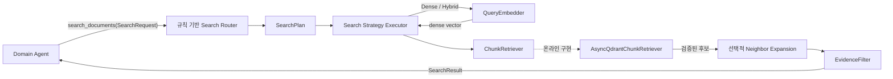

# Router Search Service용 Qdrant 검색 함수 명세

Domain Agent가 Qdrant SDK 타입을 직접 다루지 않고 제공 문서를 검색하는 목표 런타임
계약이다. 이 구조로의 전환은 [GitHub issue #80](https://github.com/nayeon653/-ace3/issues/80)에서
추적하며, 아키텍처 결정은
[Router 기반 결정론적 Search Service](../decisions/20260820-80-router-search-service.md)를
따른다. 전체 검색·저장 스키마는 다음 문서를 기준으로 한다.

- [Qdrant retrieval 계약](../qdrant-retrieval-spec.md)
- [Qdrant collection·payload 명세](qdrant-index-spec.md)

## 공개 진입점

제품 `/answer` 경로에서는 `AsyncQdrantChunkRetriever`가 async `ChunkRetriever` Port를
구현한다. 기존 `QdrantChunkRetriever`는 오프라인 적재 검증과 동기 도구에서 계속
사용하며, 온라인 Search Service에는 주입하지 않는다.

| 함수 | 목적 | Qdrant 호출 | 반환 |
| --- | --- | --- | --- |
| `await search_chunks(query, filters=None, limit=10)` | 전체 corpus의 Dense·Sparse·Hybrid 검색 | `await query_points` | `list[SearchHit]` |
| `await search_within_document(query, source_file_name, document_types=None, limit=10)` | 파일·문서군으로 제한한 검색 | `await query_points` | `list[SearchHit]` |
| `await get_neighbor_chunks(request, document_types=None)` | 허용된 문서군 안에서 앞뒤 청크 복원 | `await scroll` | `list[RetrievedChunk]` |
| `await get_chunk(chunk_id, document_types=None)` | UUID로 허용된 청크 하나 재조회 | `await retrieve` | `RetrievedChunk | None` |

온라인 생성자는 연결된 `AsyncQdrantClient`, 비어 있지 않은 collection 이름과 1~100
범위의 `prefetch_limit`을 받는다. 기본 prefetch 후보 수는 30이다.

Domain Agent에는 `search_documents` 하나만 노출한다. 이 Tool은 의미적 검색 요청인
`SearchRequest`를 Search Service에 전달하며 Qdrant 함수, 검색 모드, 후보 수와 cutoff를
직접 선택하지 않는다. Search Service는 HCX나 별도 Agent graph를 호출하지 않는다.



## SearchRequest와 SearchPlan

`SearchRequest`에는 구현 세부사항이 아니라 다음 의미 힌트만 포함한다.

| 필드 | 계약 |
| --- | --- |
| `objective` | 앞뒤 공백 제거 후 비어 있지 않은 하나의 근거 검색 목표 |
| `source_file_name` | 사용자가 제공했거나 신뢰 상태에서 확인한 원본 파일명 |
| `chunk_id` | 신뢰 상태에서 확인한 UUID 청크 ID |
| `expand_neighbors` | 최초 결과의 앞뒤 구조 문맥이 필요한지 여부 |

`permission`은 SearchRequest의 모델 생성 필드가 아니다. Domain Tool Adapter가 신뢰된
실행 값으로 Search Service에 별도 전달한다. `chunk_id`와 `source_file_name`처럼 서로
모순되는 힌트, 잘못된 UUID와 비어 있는 값은 Provider 호출 전에 거부한다.

Router는 요청과 versioned config를 불변 `SearchPlan`으로 변환한다. 계획에는 최초 경로,
정규화된 검색문, 검색 모드, permission에서 계산한 문서 유형 필터, 후보 수와 인접 확장
여부를 포함한다. 같은 요청과 설정은 같은 계획을 만들며 Router는 결과를 보고 재진입하지
않는다.

| 조건 | 최초 경로 | 검색 모드 | embedding |
| --- | --- | --- | --- |
| 검증된 `chunk_id` | `get_chunk` | 해당 없음 | 호출하지 않음 |
| 검증된 `source_file_name` | `search_within_document` | `hybrid` | 호출 |
| 그 외 | `search_chunks` | `hybrid` | 호출 |

한 요청에서 최초 경로는 정확히 하나이며 최대 한 번 실행한다. `get_neighbor_chunks`는
최초 경로가 아니라 `expand_neighbors`가 설정된 경우의 후처리 단계다. 최초 경로의
권한 검증된 최상위 후보 한 개만 기준으로 삼아 최대 한 번 실행한다. Dense·Sparse 전용
자동 라우팅과 LLM 검색어 재작성은 평가로 필요성이 확인될 때까지 사용하지 않는다.

## EvidenceFilter와 SearchResult

검색 함수의 top-k를 그대로 Domain Agent에 전달하지 않는다. EvidenceFilter는 다음
순서로 최종 후보를 만든다.

1. Search Service가 permission에 허용된 `document_type`과 route별 provenance를 재검증한다.
2. EvidenceFilter가 `chunk_id` 기준으로 중복을 제거한다.
3. Retriever 점수의 안정 순서를 유지하고 versioned score cutoff를 적용한다.
4. 검색 후보 수와 별도로 설정한 최종 전달 개수를 적용한다.
5. 인접 확장을 요청한 경우에만 anchor를 보존하며 같은 문서의 청크를 문서 순서로 결합한다.

cutoff와 최종 전달 수는 평가 baseline을 근거로 Search Service의 불변 설정에서 관리한다.
질문 목록·목차처럼 답변 근거가 아닌 후보가 최종 결과에 남지 않는지 회귀 평가하며,
검증되지 않은 cross-encoder나 새로운 모델은 이 계층에 추가하지 않는다.
점수가 없는 `get_chunk` 결과와 인접 청크에는 검색 점수 cutoff를 적용하지 않고 권한,
provenance, 중복과 최종 전달 수 계약을 적용한다.

`SearchResult`는 Python만 조립하며 자연어 설명이나 업무 결론을 포함하지 않는다.

| 필드 | 계약 |
| --- | --- |
| `execution_status` | `completed`, `failed`, `timeout` |
| `retrieved_chunks` | 원문과 provenance를 보존한 최종 청크 목록 |
| `limitations` | 완료했지만 확인하지 못한 검색 범위 |
| `error` | 실패 또는 시간 초과 시의 정제된 오류 |

완료된 검색은 빈 `retrieved_chunks`를 반환할 수 있다. 기존 `coverage`는 SearchResult에
두지 않으며 근거 충분성, 결론과 누락 조건은 Domain Agent가 `decision.status`,
`missing_conditions`, `warnings`로 판단한다. 실패와 시간 초과에는 청크를 포함하지 않고
정제된 `error`를 필수로 둔다. 반환 청크의 본문, 파일명과 위치는 LLM이 다시 작성하지
않는다.

## Domain별 문서 접근 권한

| Domain Agent | 허용 문서 유형 |
| --- | --- |
| Policy | `pension_reference` |
| Tax/Payout | `pension_reference` |
| Product | `fund_prospectus` |

`permission`은 LLM Tool 인자가 아니라 신뢰된 Domain Tool Adapter가 Search Service에
주입하는 필수 값이다. Service는 Router 실행 전에 이를 검증하며, 누락되거나 형식이
잘못되면 embedding과 Qdrant를 호출하지 않고 정제된 권한 오류로 종료한다.

```python
result = await search_service.search(request, permission=Permission.POLICY)
```

Search Strategy Executor는 권한에서 허용된 문서 유형을 Qdrant payload filter에 포함해
Dense, Sparse, Hybrid 후보를 만들기 전에 corpus를 제한한다. Retriever가 필터를 지키지
않는 구현으로 교체되거나 저장 데이터가 잘못된 경우를 대비해 Search Service가 반환
청크의 `document_type`과 route에 따른 파일명·chunk ID·인접 범위를 다시 검증한다. 파일명 검색,
인접 조회와 chunk ID 재조회에도 같은 권한을 적용한다.

`QueryEmbedder`와 `ChunkRetriever`는 Protocol이므로 Agent 계층에 Qdrant SDK나 특정
임베딩 SDK 타입을 노출하지 않는다. 임베딩 제공자가 예외를 반환하거나 유효하지 않은
vector를 반환하면 Search Service가 정제된 `error`로 변환한다. Qdrant 요청·데이터
오류도 원시 예외 대신 기존 retrieval 오류 계약의 안전한 메시지로 전달한다.

## Search Service 설정

Search Service 설정은 라우팅과 검색 품질·실행 예산을 버전 관리한다. ReAct 전용
`max_model_calls`와 `max_tool_calls`는 사용하지 않는다.

| 설정 | 초기값 | 목적 |
| --- | --- | --- |
| `max_concurrency` | `4` | 프로세스에서 동시에 실행할 검색 상한 |
| `timeout_seconds` | `45` | 상위 deadline을 넘지 않는 검색 전체 제한 |
| `default_search_mode` | `hybrid` | 일반·문서 범위 검색 방식 |
| `candidate_limit` | `10` | Retriever에서 받을 후보 수 |
| `result_limit` | `5` | EvidenceFilter가 최종 전달할 최대 청크 수 |
| `minimum_score` | `None` | 평가 후 검색 모드별로 정할 선택적 무관 후보 cutoff |
| `neighbor_before`, `neighbor_after` | 각각 `1` | 요청된 인접 문맥 범위 |

같은 입력과 설정은 같은 SearchPlan과 후보 순서를 만든다. 결과 수 최대 100개, 인접 조회
합계 최대 100개, permission과 원시 Provider·Retriever 오류 정제는 운영 안전 계약이므로
설정으로 완화할 수 없다. score의 의미가 검색 모드마다 다르므로 `minimum_score`는
평가 없이 활성화하거나 모드 사이에서 공유하지 않는다.

인접 청크 조회는 `before + after + 1 <= 100`을 공용 `NeighborRequest`와 Search
Service 실행 경계에서 함께 검증한다. 합계를 넘는 요청은 Retriever를 호출하지 않는다.

## 입력 계약

### SearchQuery

| 필드 | 계약 |
| --- | --- |
| `text` | 앞뒤 공백 제거 후 비어 있지 않은 검색문 |
| `dense` | Dense·Hybrid에서 필수인 유한 실수 vector. Sparse에서는 생략 가능 |
| `mode` | `dense`, `sparse`, `hybrid`. 기본값은 `hybrid` |

### SearchFilters

| 필드 | Qdrant 조건 |
| --- | --- |
| `source_file_name` | keyword `MatchValue` |
| `document_types` | 한 값은 keyword `MatchValue`, 여러 값은 `MatchAny` |

두 값이 함께 있으면 `must`로 결합해 모두 만족하는 Point만 검색한다. 필터가 없으면
`None`을 전달해 전체 corpus를 검색한다. `element_types`는 payload에 보존하지만
정확성과 Search Service 사용 목적을 검증하기 전에는 검색 매개변수로 제공하지 않는다.

### NeighborRequest

| 필드 | 계약 |
| --- | --- |
| `source_file_name` | 기준 청크와 동일한 비어 있지 않은 파일명 |
| `chunk_index` | 0 이상의 기준 청크 순서 |
| `before`, `after` | 각각 0 이상의 앞뒤 범위. 기본값은 1 |

인접 조회 범위는 기준 청크를 포함하며 시작값은 0보다 작아지지 않는다. 반환 결과는
`chunk_index` 오름차순이다. `before + after + 1`은 공통 조회 상한인 100 이하여야 한다.

## 출력 계약

`SearchHit`는 검증된 `RetrievedChunk`와 Qdrant 검색 점수를 함께 반환한다.
`RetrievedChunk`는 Qdrant SDK 타입을 제거하고 다음 정보를 제공한다.

- 안정 UUID `chunk_id`
- 원본 파일명·형식과 문서 유형
- 문서 내 `chunk_index`
- 인용 가능한 `content`
- 제목 계층·캡션·요소 유형·페이지 provenance
- 응답용으로 파생한 `title`과 `locator`

## 검색 결과 변환

| API 필드 | 변환 규칙 |
| --- | --- |
| `chunk_id` | `str(point.id)` |
| `source_file_name` | `payload.source_file_name` |
| `title` | `heading_path[-1]`, 없으면 파일명 stem |
| `locator` | 페이지, 제목, `chunk_index` 순으로 파생 |
| `content` | `payload.content` |

```python
def make_locator(
    page_numbers: list[int],
    heading_path: list[str],
    chunk_index: int,
) -> str:
    pages = sorted(set(page_numbers))

    if len(pages) == 1:
        return f"{pages[0]}페이지"
    if pages and pages == list(range(pages[0], pages[-1] + 1)):
        return f"{pages[0]}–{pages[-1]}페이지"
    if pages:
        return ", ".join(f"{page}페이지" for page in pages)
    if heading_path:
        return f"{heading_path[-1]} 절"
    return f"문서 내 청크 {chunk_index + 1}"
```

`embedding_content`와 내부 metadata는 평가 API에 노출하지 않는다.

## 검색 접근 계약

Qdrant SDK 타입은 `pension_agent/retrieval/` 밖으로 노출하지 않는다. 공용 타입은
`core`에 두고 `retrieval`에서 SDK 타입으로 변환한다. 구현은 DB 교체를 위한 추상
Repository를 추가하지 않고 다음 세 패턴만 사용한다.

- **Query Object**: `SearchQuery`, `SearchFilters`, `NeighborRequest`가 입력을 검증한다.
- **Filter Builder**: 허용된 세 payload index만 Qdrant 조건으로 변환한다.
- **Port/Adapter**: 온라인 Search Service의 async `ChunkRetriever` Port를
  `AsyncQdrantChunkRetriever`가 구현한다.

```python
query = SearchQuery(
    text="IRP 중도해지 절차",
    dense=(0.12, -0.34, 0.56),
    mode=SearchMode.HYBRID,
)
filters = SearchFilters(
    document_types=frozenset({DocumentType.PENSION_REFERENCE}),
)
```

```python
retriever = AsyncQdrantChunkRetriever(
    client,
    collection_name="pension_documents",
)

hits = await retriever.search_chunks(
    query,
    filters=filters,
    limit=10,
)

document_hits = await retriever.search_within_document(
    query,
    source_file_name="guide.pdf",
    document_types=frozenset({DocumentType.PENSION_REFERENCE}),
    limit=10,
)

neighbors = await retriever.get_neighbor_chunks(
    NeighborRequest(
        source_file_name="guide.pdf",
        chunk_index=7,
        before=1,
        after=1,
    ),
    document_types=frozenset({DocumentType.PENSION_REFERENCE}),
)

chunk = await retriever.get_chunk(
    "550e8400-e29b-41d4-a716-446655440000",
    document_types=frozenset({DocumentType.PENSION_REFERENCE}),
)
```

`SearchMode`는 `dense`, `sparse`, `hybrid`를 지원하며 기본값은 `hybrid`다. Hybrid
검색은 원문 질의를 dense embedding과 Kiwi token 문자열로 각각 변환한다. 같은 payload
filter로 두 결과를 prefetch한 뒤 RRF로 결합한다.

query embedding은 `aembed_query()`, Qdrant는 `AsyncQdrantClient`의 coroutine을
사용한다. 각 provider 호출은 프로세스 공용 limiter 안에서 실행한다. Kiwi tokenization은
요청 전에 prewarm하고, 검색 중에는 프로세스 수명의 단일 worker executor에서 실행해
event loop를 막지 않는다.

```python
sparse_text = await async_to_bm25_text(query.text)
await client.query_points(
    collection_name="pension_documents",
    prefetch=[
        models.Prefetch(
            query=models.Document(
                text=sparse_text,
                model="qdrant/bm25",
                options=BM25_OPTIONS,
            ),
            using="sparse",
            limit=30,
            filter=query_filter,
        ),
        models.Prefetch(
            query=query.dense,
            using="dense",
            limit=30,
            filter=query_filter,
        ),
    ],
    query=models.FusionQuery(fusion=models.Fusion.RRF),
    limit=10,
    with_payload=True,
    with_vectors=False,
)
```

- 결과는 RRF 점수 내림차순으로 반환한다.
- prefetch 30개와 최종 10개는 초기값이며 평가 결과로 조정한다.
- Hybrid에서 `to_bm25_text(query.text)`가 비어 있으면 sparse prefetch를 생략하고
  dense 검색만 수행한다.
- Sparse 전용 검색에서 전처리 결과가 비어 있으면 Qdrant를 호출하지 않고 빈 결과를
  반환한다.
- 인접 청크는 같은 파일에서 `chunk_index` 범위를 조회하고 오름차순으로 반환한다.
- 잘못된 UUID와 누락되거나 잘못된 payload는 retrieval 경계의 데이터 오류로 처리한다.

### Qdrant 기능 선택

Qdrant Query API가 제공하는 기능을 Search Service에 그대로 노출하지 않고 현재
payload와 검색 평가 계획에 필요한 부분만 채택한다.

| 기능 | 상태 | 사용 위치 또는 보류 이유 |
| --- | --- | --- |
| dense nearest | 사용 | `SearchMode.DENSE`와 hybrid prefetch |
| sparse BM25 | 사용 | `SearchMode.SPARSE`와 hybrid prefetch |
| RRF hybrid | 기본 사용 | `SearchMode.HYBRID` |
| payload filter | 사용 | 파일명·문서 유형 제한 |
| point ID retrieve | 사용 | 신뢰된 청크 ID 직접 조회 |
| filter + scroll | 사용 | 같은 파일의 인접 청크 복원 |
| recommend·discovery | 보류 | positive·negative point 피드백 계약 없음 |
| grouping·order by 검색 | 보류 | 현재 Search Service 요구와 index 없음 |
| weighted RRF·formula | 보류 | 평가셋으로 가중치를 검증한 뒤 결정 |
| random sampling | 제외 | 답변 근거 검색 목적에 부적합 |

## 함수별 세부 동작

### search_chunks

1. SearchPlan의 permission을 포함한 `SearchFilters`를 Qdrant filter로 변환한다.
2. 검색문을 Kiwi로 전처리해 Sparse BM25 입력을 만든다.
3. `SearchMode`에 맞는 Query API 요청을 만든다.
4. Qdrant payload를 검증한 뒤 `SearchHit`으로 변환한다.

`limit`은 1~100 범위다. 결과가 없으면 빈 목록을 반환한다.

### search_within_document

`source_file_name`과 허용된 `document_types`를 `SearchFilters`로 만들고
`search_chunks`에 위임한다.
별도 검색 알고리즘이나 결과 변환을 중복 구현하지 않는다.

### get_neighbor_chunks

같은 `source_file_name`, `chunk_index` 범위와 허용된 `document_types`를 `must`로
결합해 scroll한다.
벡터 유사도 검색은 수행하지 않으며 기준 청크를 포함한 구조 문맥을 복원한다.

### get_chunk

입력 UUID를 검증한 뒤 Point ID로 retrieve한다. Point가 없거나 조회된 청크가 허용된
문서 유형이 아니면 `None`을 반환한다.

## 오류 계약

| 오류 | 발생 조건 |
| --- | --- |
| `ValueError`, `TypeError` | 빈 검색문·파일명, 잘못된 limit·vector·인접 범위 |
| `RetrievalBackendError` | Qdrant 검색·scroll·retrieve 요청 실패 |
| `RetrievalDataError` | 잘못된 UUID, 누락되거나 자료형이 잘못된 payload |
| `SearchPermissionError` | permission 누락·위반 또는 허용되지 않은 검색 결과 |

payload 계약 위반을 무시하거나 부분 근거로 반환하지 않는다.

## 관련 구현과 결정

- [Router 기반 결정론적 Search Service 결정](../decisions/20260820-80-router-search-service.md)
- [GitHub issue #80](https://github.com/nayeon653/-ace3/issues/80)
- [Search Port](../../pension_agent/agent/search/ports.py)
- [공용 검색 타입](../../pension_agent/core/retrieval.py)
- [Qdrant Filter Builder](../../pension_agent/retrieval/filters.py)
- [Qdrant Retriever Adapter](../../pension_agent/retrieval/qdrant_retriever.py)
- [Qdrant hybrid queries](https://qdrant.tech/documentation/search/hybrid-queries/)
- [Qdrant filtering](https://qdrant.tech/documentation/search/filtering/)
