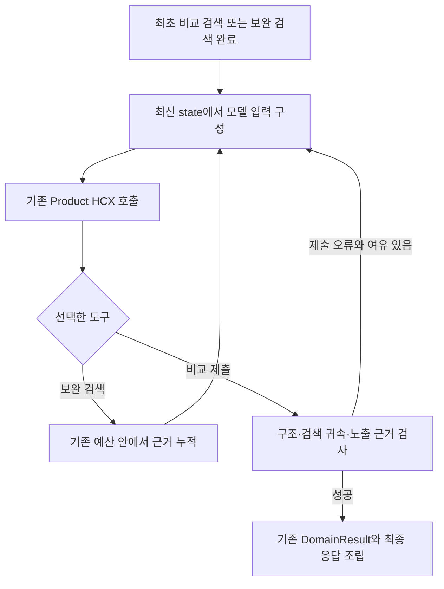

# Product 비교 작성 입력 재구성 초안

- 상태: 리뷰용 제안, 런타임 미구현
- 작성일: 2026-09-06
- 상위 계약: [상품 비교 도구](../components/product-comparison.md), [Product Agent](../agents/product-agent.md)

## 1. 목적과 1차 범위

Product의 답변 생성 책임을 유지하면서 비교 작성 직전의 모델 입력을 최신 실행 상태에서
새로 구성한다. 기존 도구 호출 이력을 계속 읽게 하는 대신, 질문·확정 대상·비교 항목·현재
근거·남은 실행 범위·직전 오류를 한 번씩 전달한다.

1차 변경은 입력 재구성과 중복 제거다. 검색된 고유 청크의 원문과 출처를 전부 보존하고,
근거 요약용 LLM이나 상품별 생성 Agent를 추가하지 않는다. 입력 토큰 예산에 맞춘 청크
제외·부분 발췌는 후속 정책으로 분리한다. 이번 변경으로 입력량 상한이나 의미 정확성이
보장된다고 표현하지 않는다.

## 2. 현재 동작과 변경 후 동작

현재는 상품 식별 결과, 최초 비교 검색 결과, 보완 검색의 누적 결과와 이전 모델 응답이
`messages`에 쌓인다. 한 검색 결과 안의 attempts 원문 중복은 제거하지만, 보완 검색 후
전체 누적 근거를 다시 전달하므로 서로 다른 메시지 사이에는 같은 원문이 반복될 수 있다.

변경 후에도 graph state와 전체 실행 이력은 그대로 보존한다. **provider에 보낼 입력만**
바꾼다. 호출 횟수 계산, 도구 실행 순서, 취소·시간 제한과 추적은 기존 이력을 사용한다.



적용 시작점은 `comparison_targets`가 있고, 최초 비교 검색이 완료되어 유효 근거가 있는
상태다. 식별·최초 검색 이전과 단일 상품 경로는 유지한다. 전체 검색 실패·근거 없음으로
이미 종료된 상태에는 새 모델 호출을 만들지 않는다.

## 3. 책임

| 구성 요소 | 책임 |
|---|---|
| `compare_products` / 보완 검색 | 기존 상품별 검색·누적 근거·실패 상태 관리 |
| Python 입력 구성기 | 최신 state를 결정론적으로 정리하고 모델에 노출할 근거 집합 확정 |
| 기존 Product HCX | 원문 해석, 비교 설명·조건 작성, 보완 검색 또는 전체 셀 제출 |
| 제출 검증 | 기존 계약에 더해 방금 모델에 노출한 근거인지 확인 |
| Main / API | 기존 비교 결과·조건·근거 보존 및 응답 조립 |

질문에서 비교 항목을 선택하는 방식, 관련 원문의 의미 판정과 최종 주장 검증은 이번
입력 구성기의 책임에 추가하지 않는다. 선택된 항목은 입력 구성 과정에서 바꾸지 않는다.

## 4. 모델에 전달하는 정보

기존 Product system prompt를 유지하고, 아래 데이터를 하나의 요청 메시지로 직렬화한다.
문서 내용은 근거 데이터로 표시하며 system 지시나 도구 실행 명령으로 승격하지 않는다.

| 필드 | 내용 |
|---|---|
| `question`, `objective` | 기존 state의 질문 원문과 판단 목표. 요약·재작성하지 않음 |
| `catalog_version`, `targets`, `criteria` | 확정된 버전·원문 표현·공식명·코드·식별 상태·비교 항목 |
| `products` | 상품 코드별 근거 ID·근거 존재 여부, 마지막 검색 시도의 상태·정제된 오류·제한 |
| `evidence` | 중복 없는 청크 ID·문서명·제목·위치·원문 |
| `execution` | 현재 허용 도구, 필수 셀 개수, 남은 검색·제출 횟수와 검색 가능 여부 |
| `feedback` | 직전 제출 또는 도구 사용 오류의 정제된 이유와 위치. 없으면 null |

개념상 데이터 모양은 다음과 같다. 외부 API 필드를 추가하는 계약은 아니다.

```text
ComparisonModelView {
  question, objective, catalog_version,
  targets: ComparisonTarget[],
  criteria: ComparisonCriterion[],
  products: [{
    product_code, evidence_ids, evidence_available,
    last_attempt_status, last_attempt_error, limitations
  }],
  evidence: [{ chunk_id, source_file_name, title, locator, content }],
  execution: {
    allowed_tools, expected_cell_count,
    supplement_calls_remaining, supplements_remaining_by_product,
    submit_calls_remaining, search_available
  },
  feedback: { kind, reason, target_id?, criterion?, invalid_ref? } | null
}
```

- 전체 상품 목록, 과거 계획 응답, 이전 비교표·자유 생성 결론은 모델 입력에서 제외한다.
- 검색 attempts의 원문·중복 metadata·내부 오류 stack은 전달하지 않는다. 상품별 실패와
  미식별 대상, 검색 제한은 반드시 보존한다.
- 최초 검색 성공 후 보완 검색이 실패하면 `evidence_available=true`와 마지막 시도의 실패를
  함께 표시한다. 마지막 실패만으로 유효한 기존 근거가 없다고 표현하지 않는다.
- 원문은 `evidence`에 한 번만 넣고 `products`가 ID로 참조한다. 같은 ID의 내용·출처가
  다르면 임의로 하나를 채택하지 않고 오류로 처리한다.
- 상품별 근거 참조 관계를 별도로 유지한다. 하나의 문서를 공유하더라도 특정 상품에서
  검색된 근거라는 관계가 다른 상품으로 자동 전용되지는 않는다.
- 대상은 기존 순서, 청크는 상품별 누적 근거 순서로 안정적으로 정렬한다. 같은 근거
  집합을 다시 구성했을 때 원문 내용과 참조 관계가 달라지지 않아야 한다.

## 5. 호출·도구 이력을 다루는 방법

새 provider 입력에는 과거 `AIMessage(tool_calls)`와 `ToolMessage`를 모두 제외한다.
짝이 없는 ToolMessage나 가짜 도구 호출을 만들지 않는다. 검색 결과와 오류는 위의 요청
데이터에 넣는다. 원래 graph의 `messages`를 삭제하거나 덮어쓰지 않는다.

모델에는 기존 실행 정책이 현재 허용한 도구만 노출한다. 과거 메시지가 없는 새 입력에서는
과거 도구를 설명하기 위한 historical schema 합집합을 사용하지 않는다. 보완 검색과 제출이
허용되면 해당 두 도구, 제출만 허용되면 제출 도구를 노출한다. 필수 비교 셀 schema는 유지한다.
검색 가능 여부는 graph의 검색 도구 호출 상한, 서비스의 전체·상품별 보완 상한과 최초 검색의
고정 deadline을 모두 만족하는지로 계산한다. 거절된 호출이 graph 횟수만 소모한 경우도
반영하며, 보완 가능한 상품이 없으면 제출만 노출한다. 입력의 남은 예산은 안내값이고 실제
도구 실행 시 기존 제한을 다시 검사한다.

`tool_choice`와 호출 제한은 원래 state와 이력으로 계산한다. 새 입력에서 마지막 AI 메시지가
없다는 이유로 제출을 강제하거나, 횟수를 0으로 되돌리지 않는다. 자유 응답·제출 오류 후의
재지시도 기존 Product 모델 호출·제출 상한과 같은 deadline 안에서만 수행한다.

## 6. 최신 입력과 인용 검증의 연결

Product의 `before_model` 단계에서 입력과 노출 근거 집합을 준비해 요청별 state의
`comparison_model_context`에 저장하는 안을 사용한다. 상태 갱신은 graph의 update로 수행한다.
`awrap_model_call`은 이 snapshot의 메시지·현재 도구를 provider 요청에 적용한다.
`request.override(messages=...)`만으로 state가 갱신된다고 가정하지 않는다.

snapshot에는 입력 데이터, revision, 상품별 노출 `(product_code, chunk_id)` 집합을 보존한다.
제출은 **그 모델 응답을 생성한 snapshot**의 근거만 참조할 수 있어야 한다. 기존의 상품·문서·
완료 검색 귀속 검사도 함께 통과해야 한다. 새 비교 state에서 snapshot이 없으면 이전 검증
범위 전체로 조용히 되돌아가지 않고 오류로 처리한다.

1차는 모든 고유 근거를 노출하므로 노출 집합과 누적 검색 근거 집합이 같다. 이 관계를
검증하고, 이후 입력 예산으로 근거를 제외할 때도 미노출 근거의 인용을 허용하지 않는다.
최종 `retrieved_context`에는 snapshot 전체가 아니라 셀에서 실제 인용한 근거만 남긴다.

보완 검색 뒤에는 새 근거·실패 상태·남은 예산을 반영해 snapshot을 다시 만든다. 보완 실패로
기존 성공 근거를 지우지 않는다. 직전 제출 오류는 오류 종류·필드 위치·대상·문제 참조를
정제해 전달하고, 이전 잘못된 결론 전체를 다시 입력하지 않는다. 모델에는 오류를 참고하여
**전체 대상×항목 셀을 새로 제출**하도록 지시한다. 오래된 오류를 현재 검색 실패로 취급하지
않도록 발생 시점의 revision과 현재 실행 상태를 구분한다.

## 7. 입력 예산과 실행 예산

1차는 고유 원문을 줄이지 않는다. 따라서 입력량 감소는 과거 이력·반복 원문·불필요한 도구
schema를 제거한 효과로만 평가한다. 보완 검색이 없는 짧은 실행에서는 감소 폭이 작을 수 있다.

기존 HCX-007 비추론·Product 출력 상한 4096, 모델 호출 상한 5회, 제출 상한 2회,
상품 2~5개·항목 1~3개와 기존 검색·시간·동시성 제한을 유지한다. 새 LLM 호출이나 토큰
계수용 외부 요청을 추가하지 않는다. 입력 구성이 실패하면 기존 큰 컨텍스트를 다시 보내
우회하지 않고, 정제된 오류로 종료한다.

실제 입력 토큰은 provider의 사용량 응답으로 기록하고, 호출 전에는 직렬화된 메시지·도구
schema의 문자/UTF-8 바이트 수를 별도로 측정한다. 문자·바이트 수를 정확한 HCX 토큰 수로
표현하지 않는다. 전체 내부 trace JSON 크기와 실제 모델 입력 크기도 구분한다.

전체 입력 토큰 상한과 상품별 근거 예산은 후속 결정이다. 도입하려면 모델과 일치하는 입력
크기 측정, system·tool schema·출력 예약을 포함한 상한, 상품 간 예산 배분, 제외 근거의
표시·인용 거절을 함께 정의해야 한다. 근거를 조용히 자르거나 일부 상품을 빼지 않는다.
문서의 주체·클래스·시점·예외가 끊길 수 있는 임의 문자열 자르기는 사용하지 않는다.

## 8. 구현 위치와 검증 기준

예상 변경 위치는 `agent/product/model_context.py`의 입력 구성기, `react.py`의 비교 전용
middleware·state·오류 전달, `comparison_submission.py`의 snapshot 검사, `prompts/domain/`의
입력·재제출 지시다. 도구 검색 결과와 원문 저장 구조는 유지한다.

| 검증 사례 | 통과 조건 |
|---|---|
| 최초 비교 작성 | 원문 질문·전체 대상·항목·고유 근거가 보존되고 과거 호출 메시지는 없음 |
| 보완 검색 반복 | 최신 근거만 한 번씩 노출, 기존 원문을 메시지마다 반복하지 않음 |
| 보완 실패·미식별 | 기존 성공 근거와 실패·누락 대상·제한을 함께 보존 |
| 인용 참조 | 노출 snapshot과 완료 검색 양쪽에서 해당 상품에 속하는 참조만 허용 |
| 제출 오류 | 직전 오류를 반영해 전체 셀 재제출, 잘못된 이전 결론은 재전달하지 않음 |
| HCX 메시지·스키마 | 고아 ToolMessage 없음, 현재 허용 도구만 노출, 실제 HCX 연결 검증 |
| 실행 상태 | 원래 이력·호출 횟수·deadline·동시성 제한 유지, 새 생성 역할 없음 |
| 최종 결과 | 기존 비교 셀·DomainResult·API 5필드 계약과 실제 인용 근거 보존 |
| 회귀 | 단일 상품·카탈로그 경로와 Main 숫자 검증의 동작 유지 |

평가는 같은 질문·목표·대상·항목·검색 원문을 고정한 제출 단계 대조부터 수행한다. 최초 입력,
보완 1회·2회, 제출 오류 이후 입력을 따로 비교해 토큰·문자 수, 청크 중복 횟수, 제출 완료와
인용 정확성을 기록한다. 이후 실제 API에서 3상품 및 최대 5상품 실행을 확인한다.

상품 식별이나 항목 선택이 달라진 실행을 순수한 컨텍스트 개선 효과로 집계하지 않는다.
입력 축소가 확인돼도 필수 항목 누락, 모·자펀드 혼동과 인용 의미 오류가 해결됐다고 판단하지
않는다. 개인 질문·원문·LangSmith 링크는 기존 개인 로컬 추적 정책을 따른다.
